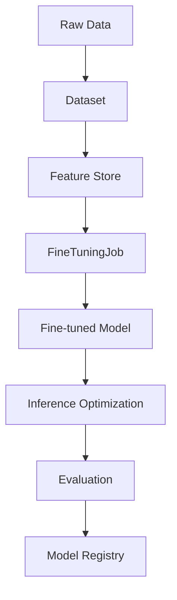

# model_ops - Functional Specification

## Purpose

To provide a structured and scalable framework for LLM operations, enabling reproducible model optimization and rigorous performance verification.

## Design Principles

- **Reproducibility**: Every model and evaluation should be tied to a specific dataset version.
- **Provider Flexibility**: Support multiple LLM providers (OpenAI, Vertex AI, AWS Bedrock).
- **Safety**: Built-in PII detection and data sanitization for datasets.
- **Observability**: Complete audit trail of training parameters and results.

## Architecture

## Functional Requirements

- **Dataset Management**: Convert various data formats (JSON, CSV, MD) into LLM-ready training files with PII sanitization.
- **Feature Store**: Centralized management of reusable features and embeddings for training and inference.
- **Fine-Tuning**: Orchestrate fine-tuning on external providers (e.g., OpenAI API).
- **Inference Optimization**: Techniques for reducing latency and cost (quantization, caching, batching).
- **Evaluation**: Run comparison evaluations (A/B testing) between models using standardized metrics.
- **Model Registry**: Versioned storage and lifecycle management for models and their metadata.

## Interface Contracts

### `DatasetSanitizer`

- `strip_keys(data: List[dict], keys: List[str]) -> List[dict]`
- `filter_by_length(data: List[dict], key: str, max_len: int) -> List[dict]`

### `Evaluator`

- `evaluate(predictions: List[str], references: List[str]) -> dict`
- Metrics: `exact_match_metric`, `length_ratio_metric`.

### `ModelRegistry`

- `register_model(name: str, model_path: str, version: str, metadata: dict)`
- `get_model(name: str, version: str) -> str`
- `list_versions(name: str) -> List[str]`

### `FeatureStore`

- `push_features(entity: str, features: dict)`
- `get_features(entity: str) -> dict`

### `InferenceOptimizer`

- `optimize(model_id: str, target: str) -> str`
- `benchmark(model_id: str) -> dict`

## Technical Constraints

- Dependent on external provider APIs.
- Large datasets may require high-bandwidth networking or specialized storage integration.
