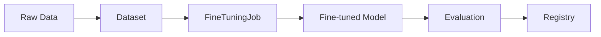

# model_ops - Functional Specification

## Purpose

To provide a structured and scalable framework for LLM operations, enabling reproducible model optimization and rigorous performance verification.

## Design Principles

- **Reproducibility**: Every model and evaluation should be tied to a specific dataset version.
- **Provider Flexibility**: Support multiple LLM providers (OpenAI, Vertex AI, AWS Bedrock).
- **Safety**: Built-in PII detection and data sanitization for datasets.
- **Observability**: Complete audit trail of training parameters and results.

## Architecture

## Functional Requirements

- Convert various data formats (JSON, CSV, MD) into LLM-ready training files.
- Orchestrate fine-tuning on external providers (e.g., OpenAI API).
- Run comparison evaluations (A/B testing) between models.
- Track fine-tuning costs and resource usage.

## Interface Contracts

### `DatasetSanitizer`

- `strip_keys(data: List[dict], keys: List[str]) -> List[dict]`
- `filter_by_length(data: List[dict], key: str, max_len: int) -> List[dict]`

### `Evaluator`

- `evaluate(predictions: List[str], references: List[str]) -> dict`
- Metrics: `exact_match_metric`, `length_ratio_metric`.

## Technical Constraints

- Dependent on external provider APIs.
- Large datasets may require high-bandwidth networking or specialized storage integration.
