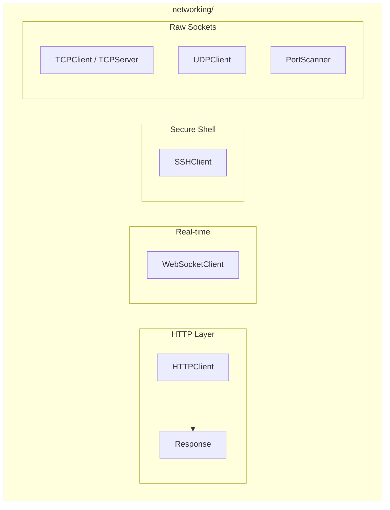

# Networking Module

**Version**: v0.1.0 | **Status**: Active | **Last Updated**: January 2026

## Overview

The Networking module provides HTTP client utilities, WebSocket support, SSH/SFTP connections, and low-level socket operations for the Codomyrmex platform.

## Architecture



## Key Classes

| Class | Purpose |
|-------|---------|
| `HTTPClient` | HTTP/HTTPS requests with sessions |
| `Response` | HTTP response wrapper |
| `WebSocketClient` | WebSocket connections |
| `SSHClient` | SSH connections and commands |
| `TCPClient` | TCP socket client |
| `TCPServer` | TCP socket server |
| `UDPClient` | UDP datagram client |
| `PortScanner` | Network port scanning |

## Exceptions

| Exception | When Raised |
|-----------|-------------|
| `NetworkError` | Base networking exception |
| `ConnectionError` | Connection failure |
| `NetworkTimeoutError` | Request timeout |
| `SSLError` | TLS/SSL issues |
| `HTTPError` | HTTP protocol errors |
| `DNSResolutionError` | DNS lookup failure |
| `WebSocketError` | WebSocket protocol errors |
| `ProxyError` | Proxy connection issues |
| `RateLimitError` | Rate limit exceeded |
| `SSHError` | SSH connection/auth failure |

## Quick Start

### HTTP Requests

```python
from codomyrmex.networking import HTTPClient, get_http_client

# Quick access
client = get_http_client()

# GET request
response = client.get("https://api.example.com/data")
print(response.json())

# POST with JSON
response = client.post("https://api.example.com/submit", json={"key": "value"})

# With headers and auth
client.set_headers({"Authorization": "Bearer token123"})
response = client.get("https://api.example.com/protected")
```

### WebSocket

```python
from codomyrmex.networking import WebSocketClient

async with WebSocketClient("wss://ws.example.com") as ws:
    await ws.send({"action": "subscribe", "channel": "updates"})
    
    async for message in ws:
        print(f"Received: {message}")
```

### SSH/SFTP

```python
from codomyrmex.networking import SSHClient

ssh = SSHClient(host="server.example.com", username="admin", key_file="~/.ssh/id_rsa")

# Execute command
result = ssh.run("ls -la /var/log")
print(result.stdout)

# SFTP file transfer
ssh.upload("local_file.txt", "/remote/path/file.txt")
ssh.download("/remote/file.txt", "local_copy.txt")
```

### Raw Sockets

```python
from codomyrmex.networking import TCPClient, PortScanner

# TCP client
client = TCPClient("localhost", 8080)
client.send(b"Hello")
response = client.receive()

# Port scanning
scanner = PortScanner("192.168.1.1")
open_ports = scanner.scan(range(1, 1024))
print(f"Open ports: {open_ports}")
```

## Integration Points

- **agents**: Agent-to-agent communication
- **cloud**: Cloud service API calls
- **llm**: LLM API requests
- **scrape**: Web scraping infrastructure

## Navigation

- **Parent**: [../README.md](../README.md)
- **Siblings**: [cloud](../cloud/), [api](../api/)
- **Spec**: [SPEC.md](SPEC.md)
