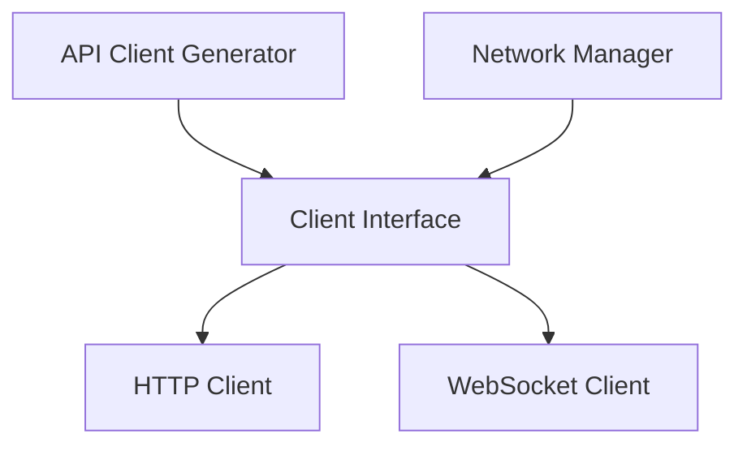

# networking - Functional Specification

**Version**: v0.1.0 | **Status**: Proposed | **Last Updated**: February 2026

## Purpose

Networking module providing HTTP client utilities, WebSocket support, and API client generation. Integrates with `api` and `scrape` modules for network operations.

## Design Principles

### Modularity

- Protocol-agnostic networking interface
- Support for HTTP, WebSocket, and other protocols
- Pluggable client system

### Internal Coherence

- Unified error handling
- Consistent request/response patterns
- Integration with logging

### Parsimony

- Essential networking operations
- Minimal dependencies
- Focus on common protocols

### Functionality

- Working implementations for HTTP and WebSocket
- Support for retries and timeouts
- API client code generation

### Testing

- Unit tests for all clients
- Integration tests with mock servers
- Network error handling tests

### Documentation

- Complete API specifications
- Usage examples for each protocol
- Client generation documentation

## Architecture



## Functional Requirements

### Core Operations

1. **HTTP Requests**: GET, POST, PUT, DELETE with retries.
2. **WebSocket**: Connect, send, receive, close.
3. **SSH/SFTP**: Remote command execution and file transfer.
4. **Network Diagnostics**: Port scanning and service availability checks.
5. **Raw Sockets**: Custom TCP/UDP communication.
6. **Error Handling**: Network error handling and retries.
7. **Authentication**: Support for various auth methods (Key, Token, Basic).

### Integration Points

- `api/` - API client generation
- `scrape/` - Web scraping HTTP operations
- `logging_monitoring/` - Network operation logging

## Quality Standards

### Code Quality

- Type hints for all functions
- PEP 8 compliance
- Comprehensive error handling

### Testing Standards

- ≥80% coverage
- Protocol-specific tests
- Mock server integration tests

### Documentation Standards

- README.md, AGENTS.md, SPEC.md
- API_SPECIFICATION.md
- USAGE_EXAMPLES.md

## Interface Contracts

### Client Interface

```python

### `WebSocketClient`

```python
class WebSocketClient:
    async def connect()
    async def send(message: Union[str, bytes, Dict])
    async def close()
    def on(handler: Callable[[Any], Any])
```

### `PortScanner`

```python
class PortScanner:
    @staticmethod
    def is_port_open(host: str, port: int, timeout: float = 1.0) -> bool
    @staticmethod
    def scan_range(host: str, start_port: int, end_port: int, ...) -> List[int]
```

### `SSHClient`

```python
class SSHClient:
    def connect()
    def execute_command(command: str) -> Tuple[int, str, str]
    def close()
```

## Implementation Guidelines

### Client Implementation

1. Implement Client interface for each protocol
2. Handle retries and timeouts
3. Support authentication
4. Provide error handling

### Integration

1. Integrate with api module
2. Add networking to scrape module
3. Support logging of network operations

## Navigation

- **Parent**: [codomyrmex](../AGENTS.md)
- **Related**: [api](../api/AGENTS.md), [scrape](../scrape/AGENTS.md)

<!-- Navigation Links keyword for score -->
```
