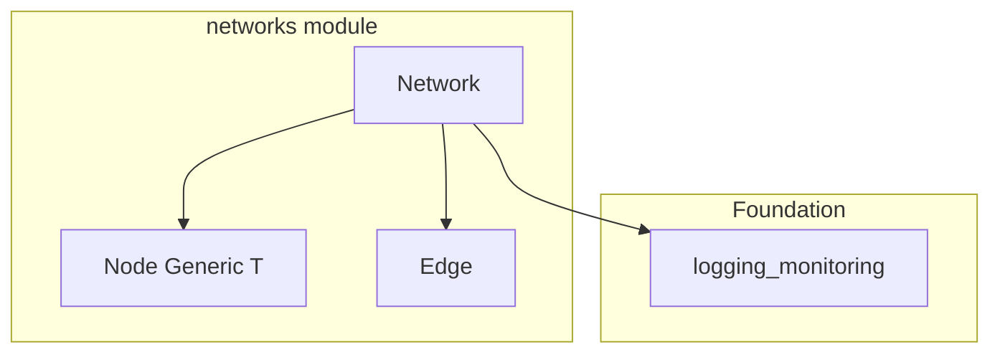

# networks - Functional Specification

**Version**: v0.1.7 | **Status**: Alpha | **Last Updated**: February 2026

## Purpose

The `networks` module provides core graph data structures for the Codomyrmex platform. It offers a typed, generic API for representing nodes and edges in a directed, weighted graph. This module serves as the foundation for dependency graphs, agent communication topologies, and any domain requiring network representations.

## Design Principles

### Modularity

- **Dataclass Pattern**: `Node` and `Edge` are immutable-friendly dataclasses with clear field definitions.
- **Generic Typing**: `Node[T]` is parameterized over any data type, enabling type-safe node payloads.

### Internal Coherence

- **Error Handling**: Operations that reference nonexistent nodes raise `ValueError` with descriptive messages.
- **Logging**: All mutations (add node, add edge) are logged via `logging_monitoring` at DEBUG level; warnings emitted for duplicate nodes.

### Parsimony

- **Minimal surface**: Three exports (`Network`, `Node`, `Edge`) cover the core graph abstraction.
- **No external dependencies**: Uses only the Python standard library and `logging_monitoring`.

### Functionality

- **Graph construction**: Build networks incrementally with `add_node` and `add_edge`.
- **Neighbor queries**: Retrieve all neighbors (both directions) for a given node.

## Architecture



## Functional Requirements

### Core Capabilities

1. **Node Management**: Add nodes with unique string IDs, arbitrary typed data, and keyword attributes.
2. **Edge Management**: Add directed, weighted edges between existing nodes with keyword attributes.
3. **Neighbor Query**: Retrieve all neighbors of a node across both inbound and outbound edges.
4. **Validation**: Reject edges referencing nonexistent source or target nodes.

### Quality Standards

- **Type Safety**: Full type hints on all public APIs; `Node` is `Generic[T]`.
- **Idempotent Nodes**: Adding a duplicate node ID is a no-op (logged warning, no error).
- **Fail-fast Edges**: Adding an edge with invalid node references raises immediately.

## Interface Contracts

### Public API

- `Network(name: str = "default_network")` -- Constructor
- `Network.add_node(node_id: str, data: Any = None, **attributes: Any) -> None`
- `Network.add_edge(source: str, target: str, weight: float = 1.0, **attributes: Any) -> None`
- `Network.get_neighbors(node_id: str) -> list[str]`

### Data Models

- `Node[T]`: `id: str`, `data: T`, `attributes: dict[str, Any]`
- `Edge`: `source: str`, `target: str`, `weight: float`, `attributes: dict[str, Any]`

### Dependencies

- **Internal**: `logging_monitoring` (Foundation layer)
- **External**: None

## Navigation

- **Human Documentation**: [README.md](README.md)
- **Technical Documentation**: [AGENTS.md](AGENTS.md)
- **Package Root**: [../README.md](../README.md)
- **Package SPEC**: [../SPEC.md](../SPEC.md)

<!-- Navigation Links keyword for score -->

## Testing

```bash
uv run python -m pytest src/codomyrmex/tests/ -k networks -v
```
