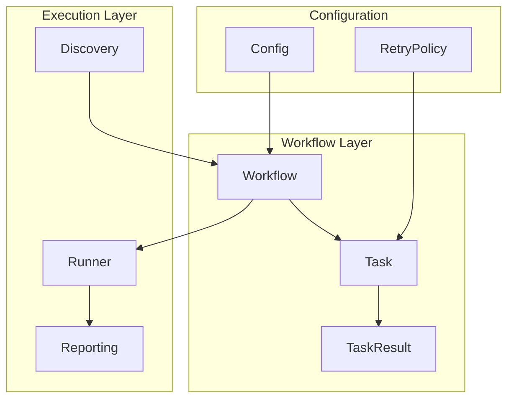
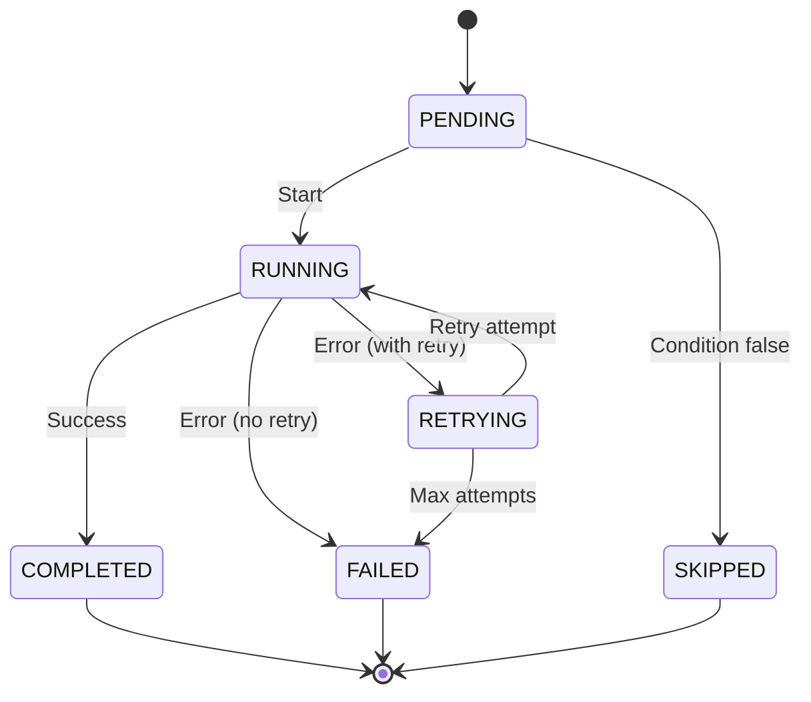

# Orchestrator Module

**Version**: v0.1.0 | **Status**: Active | **Last Updated**: January 2026

## Overview

The Orchestrator module provides workflow execution infrastructure for the Codomyrmex platform. It enables defining and executing Directed Acyclic Graphs (DAGs) of tasks with complex dependency management, parallel execution, retry logic, and progress monitoring.

## Key Features

- **DAG-Based Workflows**: Define task dependencies as directed acyclic graphs
- **Parallel Execution**: Run independent tasks concurrently
- **Retry Logic**: Configurable retry with exponential backoff
- **Conditional Execution**: Skip tasks based on runtime conditions
- **Progress Callbacks**: Real-time execution monitoring
- **Result Passing**: Share data between dependent tasks

## Architecture



## Directory Structure

```
orchestrator/
├── __init__.py      # Package exports
├── config.py        # Configuration settings
├── core.py          # Core orchestration classes
├── discovery.py     # Module and capability discovery
├── reporting.py     # Status and progress reporting
├── runner.py        # Execution engine
└── workflow.py      # Workflow and Task classes
```

## Quick Start

### Basic Workflow

```python
from codomyrmex.orchestrator import Workflow, Task

# Create a workflow
workflow = Workflow(name="my_pipeline", fail_fast=True)

# Add tasks with dependencies
workflow.add_task(
    name="fetch_data",
    action=fetch_data_function,
    timeout=30
)

workflow.add_task(
    name="process",
    action=process_function,
    dependencies=["fetch_data"]  # Runs after fetch_data
)

workflow.add_task(
    name="save_results",
    action=save_function,
    dependencies=["process"]
)

# Execute
results = workflow.run()
print(results["save_results"].value)
```

### With Retry Logic

```python
from codomyrmex.orchestrator import Workflow, RetryPolicy

workflow = Workflow(name="resilient_pipeline")

workflow.add_task(
    name="api_call",
    action=call_external_api,
    retry_policy=RetryPolicy(
        max_attempts=3,
        initial_delay=1.0,
        exponential_base=2.0
    )
)
```

### Progress Monitoring

```python
def on_progress(task_name: str, status: str, details: dict):
    print(f"[{task_name}] {status}: {details}")

workflow = Workflow(
    name="monitored_pipeline",
    progress_callback=on_progress
)
```

## Key Classes

| Class | Purpose |
|-------|---------|
| `Workflow` | Container for tasks and dependencies |
| `Task` | Single unit of work with configuration |
| `TaskResult` | Execution result container |
| `TaskStatus` | Enum for task states (PENDING, RUNNING, etc.) |
| `RetryPolicy` | Retry configuration with backoff |
| `WorkflowError` | Base exception for workflow issues |

## Task Status Flow



## Integration Points

- **logging_monitoring**: All orchestration logs via centralized logging
- **utils/ScriptBase**: CLI tools use orchestrator internally
- **agents**: Agent workflows executed through orchestrator
- **ci_cd_automation**: Pipeline definitions use orchestrator

## Navigation

- **Parent**: [../README.md](../README.md)
- **Siblings**: [build_synthesis](../build_synthesis/README.md), [logistics](../logistics/README.md)
- **Spec**: [SPEC.md](SPEC.md)
- **API**: [API_SPECIFICATION.md](API_SPECIFICATION.md)
