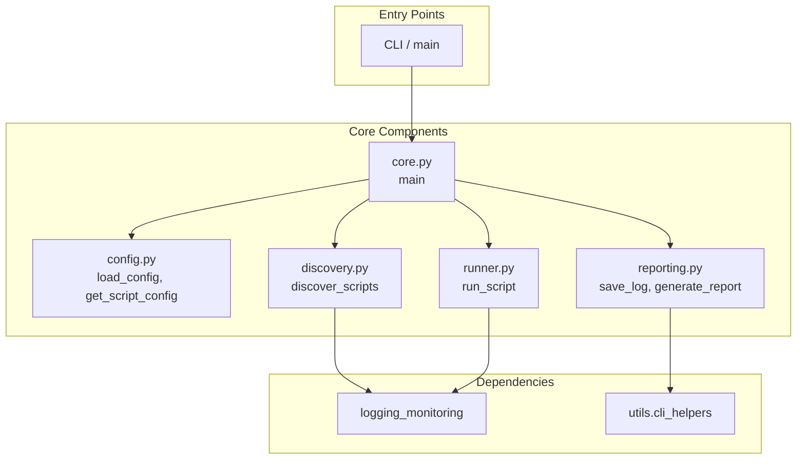

# orchestrator - Functional Specification

**Version**: v0.1.0 | **Status**: Active | **Last Updated**: January 2026

## Purpose

Provide centralized script orchestration capabilities for discovering, configuring, executing, and reporting on Python scripts within the Codomyrmex project.

## Design Principles

### Modularity

- Separate concerns: discovery, configuration, execution, reporting
- Each component is independently testable
- Clear interfaces between components

### Internal Coherence

- Consistent result structures across all operations
- Unified logging via `logging_monitoring`
- Standardized CLI output via `utils.cli_helpers`

### Parsimony

- Dependencies: `logging_monitoring`, `utils.cli_helpers`
- Foundation layer module with minimal external requirements
- Focus on script execution without higher-level abstractions

### Functionality

- Subprocess-based execution with timeout control
- Configurable per-script settings via YAML
- JSON logs and Markdown reports

### Testing

- Unit tests for each component
- Integration tests for full orchestration flow
- Real script execution (no mocks)

## Architecture



## Functional Requirements

### Script Discovery

- Traverse directory trees with configurable max depth
- Apply exclusion filters via `SKIP_DIRS` and `SKIP_PATTERNS`
- Support subdirectory filtering and glob patterns
- Return sorted list of script paths

### Configuration

- Load YAML configuration files
- Provide per-script overrides for timeout, args, env, exit codes
- Support default fallback values

### Execution

- Run scripts via `subprocess.run()` with capture
- Set working directory and environment variables
- Add project `src/` to `PYTHONPATH` automatically
- Handle timeout and error conditions
- Return structured result dictionary

### Reporting

- Save individual script logs as JSON
- Generate Markdown summary reports
- Generate script documentation from discovery

## Interface Contracts

### Public API (via `__init__.py`)

```python
from codomyrmex.orchestrator import run_orchestrator, load_config, get_script_config

# Main entry point
exit_code = run_orchestrator()

# Configuration access
config = load_config(config_path)
script_config = get_script_config(config, script_name)
```

### Result Structure

```python
{
    "script": str,           # Full path
    "name": str,             # Script filename
    "subdirectory": str,     # Parent directory name
    "start_time": str,       # ISO timestamp
    "end_time": str,         # ISO timestamp
    "status": str,           # "passed" | "failed" | "timeout" | "error"
    "exit_code": int | None,
    "execution_time": float, # Seconds
    "stdout": str,
    "stderr": str,
    "error": str | None,
}
```

## Quality Standards

- All public functions have type hints
- Docstrings for all public functions
- Structured logging for execution events
- Graceful error handling with informative messages

## Navigation

- **Human Documentation**: [README.md](README.md)
- **Technical Documentation**: [AGENTS.md](AGENTS.md)
- **Parent Directory**: [codomyrmex](../README.md)
- **Repository Root**: [../../README.md](../../README.md)
- **Repository SPEC**: [../../SPEC.md](../../SPEC.md)
