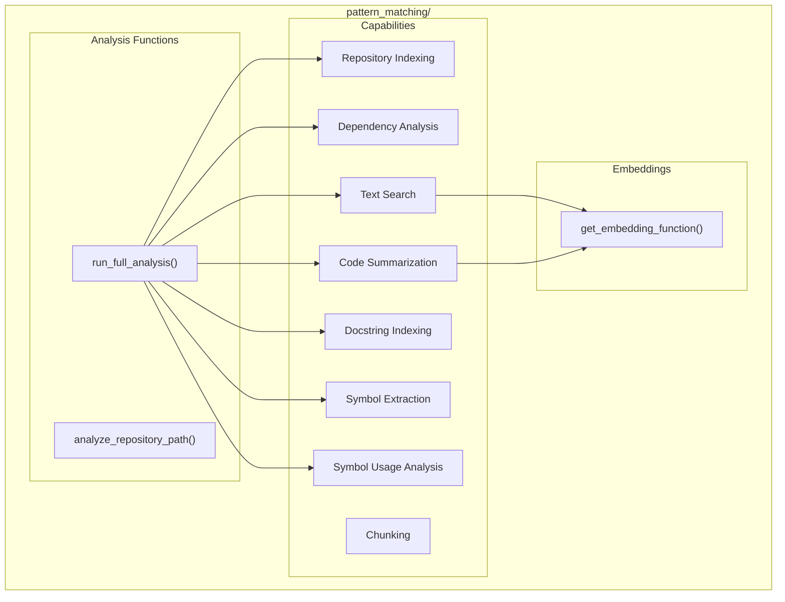

# Pattern Matching Module

**Version**: v0.1.0 | **Status**: Active | **Last Updated**: January 2026

## Overview

The Pattern Matching module identifies patterns and structures within the Codomyrmex codebase. It utilizes the `cased/kit` toolkit for code analysis, embedding generation, symbol extraction, and semantic search across repositories.

## Architecture



## Key Functions

| Function | Purpose |
|----------|---------|
| `get_embedding_function()` | Get embedding function for semantic search |
| `analyze_repository_path()` | Analyze a repository path |
| `run_full_analysis()` | Run complete analysis pipeline |

### Internal Analysis Functions

| Function | Purpose |
|----------|---------|
| `_perform_repository_index()` | Index repository structure |
| `_perform_dependency_analysis()` | Analyze dependencies |
| `_perform_text_search()` | Semantic text search |
| `_perform_code_summarization()` | Summarize code blocks |
| `_perform_docstring_indexing()` | Index docstrings |
| `_perform_symbol_extraction()` | Extract symbols (functions, classes) |
| `_perform_symbol_usage_analysis()` | Analyze symbol usage patterns |
| `_perform_text_search_context_extraction()` | Extract context around matches |
| `_perform_chunking_examples()` | Demonstrate code chunking |

## Quick Start

### Full Repository Analysis

```python
from codomyrmex.pattern_matching import run_full_analysis

results = run_full_analysis("src/codomyrmex/")

print(f"Files analyzed: {results.file_count}")
print(f"Symbols found: {results.symbol_count}")
print(f"Patterns detected: {len(results.patterns)}")
```

### Analyze Specific Path

```python
from codomyrmex.pattern_matching import analyze_repository_path

analysis = analyze_repository_path("src/codomyrmex/agents/")

for pattern in analysis.patterns:
    print(f"{pattern.type}: {pattern.description}")
```

### Semantic Search

```python
from codomyrmex.pattern_matching import (
    get_embedding_function,
    _perform_text_search
)

embed_fn = get_embedding_function()

# Search for code patterns
results = _perform_text_search(
    "authentication middleware",
    embed_function=embed_fn
)
```

### Symbol Extraction

```python
from codomyrmex.pattern_matching import _perform_symbol_extraction

symbols = _perform_symbol_extraction("src/codomyrmex/agents/")

for symbol in symbols:
    print(f"{symbol.type}: {symbol.name} at {symbol.location}")
```

## Integration Points

- **logging_monitoring**: All logging via centralized system
- **environment_setup**: Dependency verification
- **static_analysis**: Complements static code analysis
- **llm**: Embeddings for semantic search

## Navigation

- **Parent**: [../README.md](../README.md)
- **Siblings**: [static_analysis](../static_analysis/), [coding](../coding/)
- **Spec**: [SPEC.md](SPEC.md)
