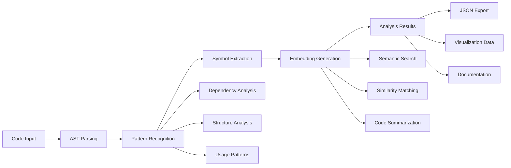

# src/codomyrmex/pattern_matching

## Signposting
- **Parent**: [codomyrmex](../README.md)
- **Children**:
    - [docs](docs/README.md)
    - [tests](tests/README.md)
- **Key Artifacts**:
    - [Agent Guide](AGENTS.md)
    - [Functional Spec](SPEC.md)

**Version**: v0.1.0 | **Status**: Active | **Last Updated**: December 2025

## Overview

Core module providing pattern recognition and code analysis capabilities for the Codomyrmex platform. This module identifies patterns, structures, and relationships within codebases using advanced analysis techniques.

## Pattern Analysis Workflow



The pattern analysis workflow processes source code through AST parsing, pattern recognition, symbol extraction, and embedding generation to produce structured analysis results for code understanding and automation.

## Directory Contents
- `.gitignore` – File
- `API_SPECIFICATION.md` – File
- `CHANGELOG.md` – File
- `MCP_TOOL_SPECIFICATION.md` – File
- `SECURITY.md` – File
- `USAGE_EXAMPLES.md` – File
- `__init__.py` – File
- `docs/` – Subdirectory
- `requirements.txt` – File
- `run_codomyrmex_analysis.py` – File
- `tests/` – Subdirectory

## Navigation
- **Technical Documentation**: [AGENTS.md](AGENTS.md)
- **Functional Specification**: [SPEC.md](SPEC.md)
- **Project Root**: [README](../../../README.md)
- **Parent Directory**: [codomyrmex](../README.md)
- **Src Hub**: [src](../../../src/README.md)

## Getting Started

To use this module in your project, import the necessary components:

```python
# Example usage
from codomyrmex.codomyrmex.pattern_matching import main_component

def example():
    
    print(f"Result: {result}")
```

<!-- Navigation Links keyword for score -->
