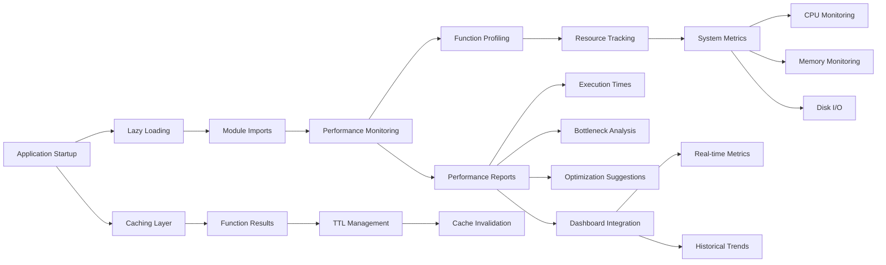

# src/codomyrmex/performance

**Version**: v0.1.0 | **Status**: Active | **Last Updated**: December 2025

## Overview

Core module providing performance optimization and monitoring capabilities for the Codomyrmex platform. This module enables lazy loading, caching, resource tracking, and performance profiling to optimize startup time and runtime performance across all platform components.

The performance module serves as the optimization layer, ensuring efficient resource usage and providing visibility into system performance characteristics.

## Performance Optimization Flow

The performance optimization flow provides comprehensive monitoring and optimization from application startup through runtime execution, with caching, lazy loading, and detailed performance analysis.

## Directory Contents
- `API_SPECIFICATION.md` – File
- `MCP_TOOL_SPECIFICATION.md` – File
- `SECURITY.md` – File
- `__init__.py` – File
- `cache_manager.py` – File
- `lazy_loader.py` – File
- `performance_monitor.py` – File
- `requirements.txt` – File

## Navigation
- **Project Root**: [README](../../../README.md)
- **Parent Directory**: [codomyrmex](../README.md)
- **Src Hub**: [src](../../../src/README.md)
