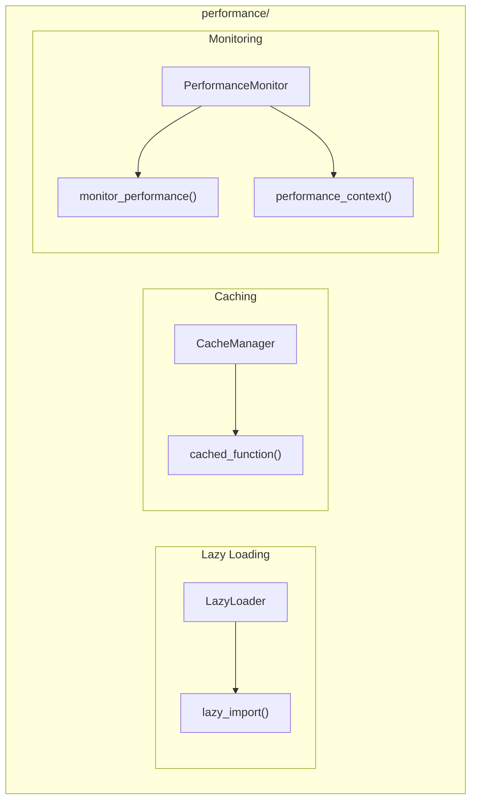

# Performance Module

**Version**: v0.1.0 | **Status**: Active | **Last Updated**: January 2026

## Overview

The Performance module provides performance optimization utilities for the Codomyrmex platform, including lazy loading, function caching, performance monitoring, and profiling.

## Architecture



## Key Classes

| Class | Purpose |
|-------|---------|
| `LazyLoader` | Lazy module/class loading |
| `CacheManager` | Function result caching |
| `PerformanceMonitor` | Execution monitoring (optional) |

## Functions

| Function | Purpose |
|----------|---------|
| `lazy_import()` | Lazy import a module |
| `cached_function()` | Cache function results |
| `monitor_performance()` | Decorator for monitoring |
| `performance_context()` | Context manager for timing |
| `profile_function()` | Profile function execution |
| `get_system_metrics()` | Get system resource metrics |

## Quick Start

### Lazy Loading

```python
from codomyrmex.performance import LazyLoader, lazy_import

# Lazy import - module only loaded when accessed
pandas = lazy_import("pandas")

# Later, when actually used:
df = pandas.DataFrame({"a": [1, 2, 3]})  # Now pandas is loaded
```

### Function Caching

```python
from codomyrmex.performance import CacheManager, cached_function

cache = CacheManager()

@cached_function(ttl=300)  # Cache for 5 minutes
def expensive_computation(x, y):
    # ... expensive work ...
    return result

# First call computes, subsequent calls return cached
result1 = expensive_computation(1, 2)  # Computed
result2 = expensive_computation(1, 2)  # Cached
```

### Performance Monitoring

```python
from codomyrmex.performance import (
    monitor_performance,
    performance_context,
    PerformanceMonitor
)

@monitor_performance(name="my_function")
def process_data(data):
    # ... processing ...
    return result

# Or use context manager
with performance_context("data_processing"):
    result = process_large_dataset()
```

### System Metrics

```python
from codomyrmex.performance import get_system_metrics

metrics = get_system_metrics()
print(f"CPU: {metrics['cpu_percent']}%")
print(f"Memory: {metrics['memory_percent']}%")
```

## Optional Dependencies

PerformanceMonitor requires `psutil`. If not installed, no-op versions are provided.

```python
from codomyrmex.performance import PERFORMANCE_MONITOR_AVAILABLE

if PERFORMANCE_MONITOR_AVAILABLE:
    print("Full monitoring available")
else:
    print("Install psutil for full monitoring")
```

## Integration Points

- **metrics**: Metric collection
- **logging_monitoring**: Performance logging
- **coding**: Execution performance

## Navigation

- **Parent**: [../README.md](../README.md)
- **Siblings**: [metrics](../metrics/), [logging_monitoring](../logging_monitoring/)
- **Spec**: [SPEC.md](SPEC.md)
