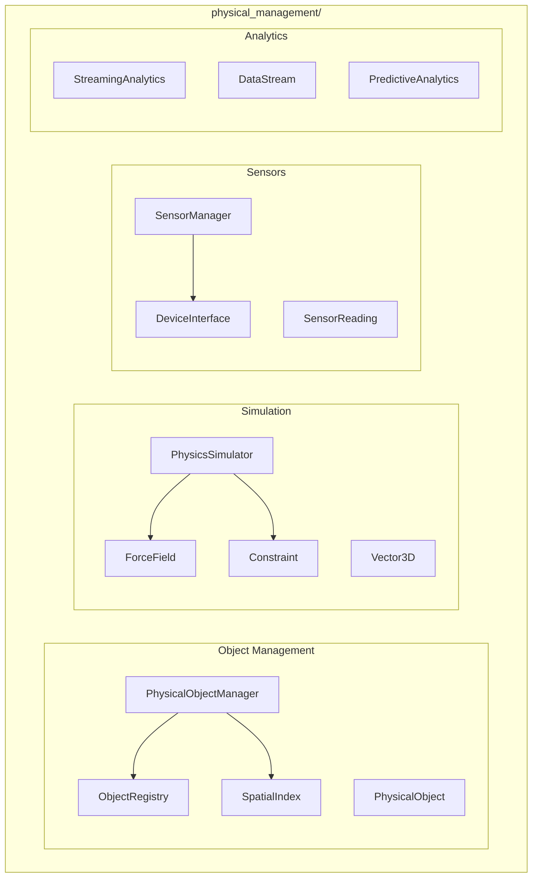

# Physical Management Module

**Version**: v0.2.0 | **Status**: Active | **Last Updated**: January 2026

## Overview

The Physical Management module provides physical object management, physics simulation, sensor integration, and streaming analytics capabilities for the Codomyrmex platform, enabling physical computing and IoT device management.

## Architecture



## Key Classes

### Object Management

| Class | Purpose |
|-------|---------|
| `PhysicalObjectManager` | Manage physical objects |
| `PhysicalObject` | Object representation |
| `ObjectRegistry` | Object registry |
| `SpatialIndex` | Spatial indexing |
| `ObjectType`, `ObjectStatus` | Enums |
| `MaterialType`, `MaterialProperties` | Materials |

### Simulation

| Class | Purpose |
|-------|---------|
| `PhysicsSimulator` | Physics engine |
| `ForceField` | Force field definition |
| `Constraint` | Physical constraint |
| `Vector3D` | 3D vector math |

### Sensors

| Class | Purpose |
|-------|---------|
| `SensorManager` | Sensor orchestration |
| `SensorReading` | Sensor data |
| `DeviceInterface` | Device abstraction |
| `SensorType`, `DeviceStatus` | Enums |

### Analytics

| Class | Purpose |
|-------|---------|
| `StreamingAnalytics` | Real-time analytics |
| `DataStream` | Data stream |
| `PredictiveAnalytics` | ML predictions |

## Quick Start

### Object Management

```python
from codomyrmex.physical_management import (
    PhysicalObjectManager,
    PhysicalObject,
    ObjectType
)

manager = PhysicalObjectManager()

obj = PhysicalObject(
    name="sensor-1",
    type=ObjectType.SENSOR,
    position=Vector3D(1.0, 2.0, 3.0)
)

manager.register(obj)
```

### Physics Simulation

```python
from codomyrmex.physical_management import (
    PhysicsSimulator,
    ForceField,
    Vector3D
)

sim = PhysicsSimulator()

# Add gravity
sim.add_force(ForceField(
    direction=Vector3D(0, -9.8, 0),
    type="gravity"
))

# Run simulation
sim.step(dt=0.016)  # 60 FPS
```

### Sensor Integration

```python
from codomyrmex.physical_management import (
    SensorManager,
    SensorType
)

sensors = SensorManager()

# Register sensor
sensors.register("temp-1", type=SensorType.TEMPERATURE)

# Read data
reading = sensors.read("temp-1")
print(f"Temperature: {reading.value}°C")
```

### Streaming Analytics

```python
from codomyrmex.physical_management import (
    StreamingAnalytics,
    DataStream
)

analytics = StreamingAnalytics()

stream = DataStream("temperature")
analytics.attach(stream)

# Process in real-time
analytics.on_data(lambda d: print(f"New: {d}"))
```

## Integration Points

- **spatial**: 3D spatial operations
- **embodiment**: Robot embodiment
- **events**: Sensor events

## Navigation

- **Parent**: [../README.md](../README.md)
- **Siblings**: [spatial](../spatial/), [embodiment](../embodiment/)
- **Spec**: [SPEC.md](SPEC.md)
