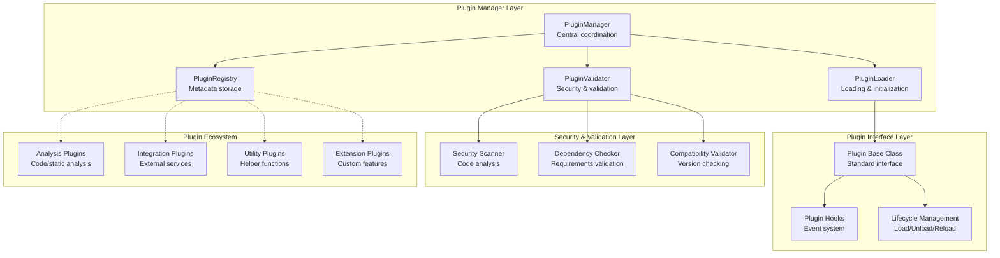
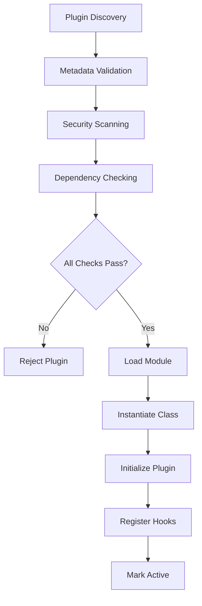

# Codomyrmex Plugin System

## Signposting
- **Parent**: [codomyrmex](../README.md)
- **Children**:
    - None
- **Key Artifacts**:
    - [Agent Guide](AGENTS.md)
    - [Functional Spec](SPEC.md)

**Version**: v0.1.0 | **Status**: Active | **Last Updated**: December 2025

## Overview

The Codomyrmex Plugin System provides a framework for extending the platform's functionality through third-party plugins. Built on a modular architecture with security validation, the system enables safe plugin development and deployment.

## Architecture

### Core Components



## Plugin Types

### Analysis Plugins
- **Purpose**: Code analysis, static analysis, quality metrics
- **Examples**: Custom linters, complexity analyzers, security scanners
- **Hook Points**: `pre_analysis`, `post_analysis`, `analysis_complete`

### Integration Plugins
- **Purpose**: External service integration, API connections
- **Examples**: Database connectors, cloud service clients, monitoring integrations
- **Hook Points**: `service_connect`, `service_disconnect`, `data_sync`

### Visualization Plugins
- **Purpose**: Data visualization, chart generation, reporting
- **Examples**: Custom plot generators, dashboard builders, report formatters
- **Hook Points**: `pre_render`, `post_render`, `visualization_complete`

### Transformation Plugins
- **Purpose**: Data transformation, format conversion, processing pipelines
- **Examples**: Data cleaners, format converters, ETL processors
- **Hook Points**: `transform_start`, `transform_step`, `transform_complete`

### Utility Plugins
- **Purpose**: General utilities, helpers, and extensions
- **Examples**: Custom commands, configuration helpers, utility functions
- **Hook Points**: `utility_execute`, `utility_complete`

## Developing Plugins

### Plugin Structure

Every plugin must follow this structure:

```
my_plugin/
├── __init__.py          # Plugin initialization
├── plugin.json          # Plugin metadata
├── my_plugin.py         # Main plugin implementation
├── requirements.txt     # Dependencies (optional)
└── README.md           # Documentation (recommended)
```

### Plugin Metadata (plugin.json)

```json
{
  "name": "my_analysis_plugin",
  "version": "1.0.0",
  "description": "Custom code analysis plugin",
  "author": "Your Name",
  "plugin_type": "analysis",
  "entry_point": "my_plugin.py",
  "dependencies": ["requests", "beautifulsoup4"],
  "config_schema": {
    "api_endpoint": {
      "type": "str",
      "required": true,
      "description": "API endpoint URL"
    },
    "timeout": {
      "type": "int",
      "default": 30,
      "constraints": {"min": 1, "max": 300}
    }
  },
  "homepage": "https://github.com/yourname/my_plugin",
  "license": "MIT",
  "tags": ["analysis", "security", "api"]
}
```

### Plugin Implementation

```python
from codomyrmex.plugin_system import Plugin, PluginInfo, PluginType

class MyAnalysisPlugin(Plugin):
    """Custom analysis plugin example."""

    def initialize(self, config: dict) -> bool:
        """Initialize the plugin with configuration."""
        self.api_endpoint = config.get('api_endpoint')
        self.timeout = config.get('timeout', 30)

        # Register hook handlers
        self.register_hook('pre_analysis', self.on_pre_analysis)
        self.register_hook('post_analysis', self.on_post_analysis)

        self.logger.info("MyAnalysisPlugin initialized")
        return True

    def shutdown(self) -> None:
        """Clean up plugin resources."""
        self.logger.info("MyAnalysisPlugin shutting down")

    def on_pre_analysis(self, code: str, language: str) -> dict:
        """Handle pre-analysis hook."""
        self.logger.info(f"Pre-analysis hook called for {language}")
        # Custom pre-processing logic
        return {"preprocessed": True}

    def on_post_analysis(self, results: dict) -> dict:
        """Handle post-analysis hook."""
        self.logger.info("Post-analysis hook called")
        # Custom post-processing logic
        updated_results = results.copy()
        updated_results['custom_metric'] = self.calculate_custom_metric(results)
        return enhanced_results

    def calculate_custom_metric(self, results: dict) -> float:
        """Calculate a custom analysis metric."""
        # Implementation here
        return 0.85

    def analyze_code(self, code: str, language: str) -> dict:
        """Main analysis function."""
        # Plugin-specific analysis logic
        analysis_result = {
            "language": language,
            "lines_of_code": len(code.split('
')),
            "complexity_score": self.calculate_complexity(code),
            "custom_findings": []
        }

        # Emit plugin-specific hook
        self.emit_hook('analysis_complete', analysis_result)

        return analysis_result
```

### Single-File Plugin

For simple plugins, you can create a single file with embedded metadata:

```python
# my_simple_plugin.py

# plugin: {"name": "simple_util", "version": "1.0.0", "type": "utility", "dependencies": []}

from codomyrmex.plugin_system import Plugin, PluginInfo, PluginType

class SimpleUtilPlugin(Plugin):
    """Simple utility plugin."""

    def initialize(self, config: dict) -> bool:
        self.logger.info("Simple utility plugin loaded")
        return True

    def shutdown(self):
        pass

    def do_something_useful(self) -> str:
        return "Something useful done!"
```

## Plugin Lifecycle

### Loading Process



### States

- **UNLOADED**: Plugin not loaded
- **LOADING**: Plugin module being loaded
- **INITIALIZING**: Plugin initialization in progress
- **ACTIVE**: Plugin fully loaded and operational
- **ERROR**: Plugin encountered an error
- **DISABLED**: Plugin temporarily disabled

## Hook System

### Global Hooks

Plugins can connect to system-wide hooks:

```python
# Register a global hook handler
plugin_manager.register_hook('system_startup', my_startup_handler)

# Emit a global hook
results = plugin_manager.emit_hook('system_startup', config_data)
```

### Plugin-Specific Hooks

```python
# Register plugin-specific hook
self.register_hook('custom_event', self.handle_custom_event)

# Emit to plugin handlers
results = self.emit_hook('custom_event', data)
```

### Common Hook Points

- **System Hooks**: `system_startup`, `system_shutdown`, `config_reload`
- **Analysis Hooks**: `pre_analysis`, `analysis_step`, `post_analysis`
- **Integration Hooks**: `service_connect`, `service_call`, `service_disconnect`
- **Lifecycle Hooks**: `plugin_load`, `plugin_unload`, `plugin_error`

## Security & Validation

### Automatic Security Scanning

The plugin system automatically scans for:

- **Risky Imports**: `os.system`, `subprocess.call`, `eval`, `pickle.loads`
- **Suspicious Patterns**: File system operations, network calls, shell commands
- **Hardcoded Secrets**: API keys, passwords in source code
- **Unsafe Permissions**: Overly permissive file operations

### Dependency Validation

- **Package Availability**: Checks if required packages are installed
- **Version Compatibility**: Validates package version requirements
- **Security Vulnerabilities**: Scans for known vulnerable dependencies

### Configuration Validation

- **Schema Validation**: Validates plugin configuration against schema
- **Type Checking**: Ensures configuration values have correct types
- **Constraint Validation**: Checks value ranges and patterns

## Usage Examples

### Basic Plugin Management

```python
from codomyrmex.plugin_system import get_plugin_manager

# Get plugin manager
manager = get_plugin_manager()

# Discover available plugins
plugins = manager.discover_plugins()
print(f"Found {len(plugins)} plugins")

# Load a plugin
result = manager.load_plugin('my_analysis_plugin', {'api_key': 'secret'})
if result.success:
    print("Plugin loaded successfully")
else:
    print(f"Plugin loading failed: {result.error_message}")

# Use the plugin
plugin = manager.get_plugin('my_analysis_plugin')
if plugin:
    result = plugin.analyze_code("def hello(): pass", "python")
    print(f"Analysis result: {result}")

# Unload plugin
manager.unload_plugin('my_analysis_plugin')
```

### Asynchronous Plugin Loading

```python
import asyncio
from codomyrmex.plugin_system import get_plugin_manager

async def load_plugins_async():
    manager = get_plugin_manager()

    plugin_configs = {
        'analysis_plugin': {'level': 'detailed'},
        'integration_plugin': {'endpoint': 'https://api.example.com'}
    }

    results = await manager.load_plugins_async(
        ['analysis_plugin', 'integration_plugin'],
        plugin_configs
    )

    for name, result in results.items():
        if result.success:
            print(f"✅ {name} loaded successfully")
        else:
            print(f"❌ {name} failed: {result.error_message}")
```

### Hook Usage

```python
from codomyrmex.plugin_system import get_plugin_manager

manager = get_plugin_manager()

# Register a hook for custom events
def on_analysis_complete(results):
    print(f"Analysis completed with {len(results)} findings")
    # Custom processing logic

manager.register_hook('analysis_complete', on_analysis_complete)

# Plugins can now emit this hook
manager.emit_hook('analysis_complete', {'findings': 5, 'severity': 'low'})
```

## Plugin Development Best Practices

### Security
- Never hardcode secrets or credentials
- Use secure coding practices
- Validate all inputs and outputs
- Implement proper error handling

### Performance
- Initialize expensive resources once in `initialize()`
- Clean up resources in `shutdown()`
- Use asynchronous operations where appropriate
- Implement proper logging without spam

### Compatibility
- Specify accurate version constraints
- Test with multiple Codomyrmex versions
- Document breaking changes
- Provide migration guides

### Documentation
- Include README
- Document all configuration options
- Provide usage examples
- List known limitations

## Testing Plugins

### Unit Testing

```python
import pytest
from codomyrmex.plugin_system import PluginManager

class TestMyPlugin:
    def test_plugin_initialization(self):
        manager = PluginManager()

        # Test plugin loading
        result = manager.load_plugin('my_plugin', {'config': 'value'})
        assert result.success

        plugin = manager.get_plugin('my_plugin')
        assert plugin is not None
        assert plugin.get_state().value == 'active'

    def test_plugin_functionality(self):
        manager = PluginManager()
        manager.load_plugin('my_plugin')

        plugin = manager.get_plugin('my_plugin')

        # Test plugin methods
        result = plugin.do_something()
        assert result is not None
        assert 'expected' in result

    def test_plugin_validation(self):
        from codomyrmex.plugin_system import PluginValidator

        validator = PluginValidator()
        result = validator.validate_plugin('/path/to/plugin')

        assert result.is_valid
        assert result.security_score >= 80
```

## Plugin Distribution

### Directory Structure

```
plugins/
├── official/
│   ├── analysis/
│   │   ├── complexity_analyzer/
│   │   └── security_scanner/
│   └── integration/
│       ├── database_connector/
│       └── cloud_sync/
├── community/
│   ├── custom_linter/
│   └── reporting_tool/
└── user/
    ├── my_analysis_plugin/
    └── utility_helper/
```

### Plugin Registry

Plugins can be published to the official registry:

```json
{
  "name": "official_complexity_analyzer",
  "version": "2.1.0",
  "author": "Codomyrmex Team",
  "download_url": "https://plugins.codomyrmex.dev/complexity_analyzer-2.1.0.tar.gz",
  "signature": "verified",
  "downloads": 15420,
  "rating": 4.8
}
```

## Troubleshooting

### Common Issues

**Plugin Loading Fails**
- Check plugin metadata is valid JSON
- Ensure entry_point file exists
- Verify dependencies are installed
- Check security validation results

**Hook Not Triggering**
- Ensure hook is registered before emission
- Check hook name spelling
- Verify plugin is in ACTIVE state

**Security Validation Errors**
- Remove hardcoded secrets
- Replace risky imports with safe alternatives
- Add proper input validation
- Review file permission settings

### Debug Mode

Enable debug logging for detailed plugin information:

```python
import logging
logging.getLogger('codomyrmex.plugin_system').setLevel(logging.DEBUG)
```

## API Reference

### PluginManager

- `discover_plugins() -> List[PluginInfo]`
- `load_plugin(name: str, config: dict) -> LoadResult`
- `unload_plugin(name: str) -> bool`
- `get_plugin(name: str) -> Plugin`
- `list_plugins(type_filter: PluginType) -> List[PluginInfo]`

### PluginValidator

- `validate_plugin(path: str) -> ValidationResult`
- `check_plugin_security(path: str) -> List[str]`
- `validate_plugin_metadata(metadata: dict) -> List[str]`

### PluginLoader

- `discover_plugins() -> List[PluginInfo]`
- `load_plugin(info: PluginInfo, config: dict) -> LoadResult`
- `unload_plugin(name: str) -> bool`

### PluginRegistry

- `register_plugin(plugin: Plugin) -> None`
- `get_plugin_info(name: str) -> PluginInfo`
- `list_plugins(type_filter: PluginType) -> List[PluginInfo]`

## Contributing

### Plugin Submission Process

1. **Develop**: Create plugin following guidelines
2. **Test**: Ensure test coverage
3. **Validate**: Pass security and compatibility checks
4. **Document**: Provide complete documentation
5. **Submit**: Create pull request with plugin

### Review Criteria

- **Security**: No vulnerabilities or risky patterns
- **Quality**: Clean code, proper error handling, documentation
- **Compatibility**: Works with target Codomyrmex versions
- **Testing**: Comprehensive test suite included
- **Documentation**: Clear usage instructions and examples

## License

Plugin system components are licensed under MIT. Individual plugins may have different licenses as specified in their metadata.

## Support

- **Documentation**: See this README for plugin development guide
- **Issues**: [GitHub Issues](https://github.com/codomyrmex/codomyrmex/issues)
- **Discussions**: [GitHub Discussions](https://github.com/codomyrmex/codomyrmex/discussions)
- **Email**: plugins@codomyrmex.dev

## Navigation

- **Human Documentation**: [README.md](README.md)
- **Technical Documentation**: [AGENTS.md](AGENTS.md)
- **Functional Specification**: [SPEC.md](SPEC.md)
- **Parent Directory**: [codomyrmex](../README.md)
- **Repository Root**: [../../../README.md](../../../README.md)
- **Repository SPEC**: [../../../SPEC.md](../../../SPEC.md)


## Getting Started

To use this module in your project, import the necessary components:

```python
# Example usage
from codomyrmex.codomyrmex.plugin_system import main_component

def example():
    result = main_component.process()
    print(f"Result: {result}")
```

## detailed_overview

This module is a critical part of the Codomyrmex ecosystem. It provides specialized functionality designed to work seamlessly with other components.
The architecture focuses on modularity, reliability, and performance.

## Contributing

We welcome contributions! Please ensure you:
1.  Follow the project coding standards.
2.  Add tests for new functionality.
3.  Update documentation as needed.

See the root `CONTRIBUTING.md` for more details.

<!-- Navigation Links keyword for score -->
