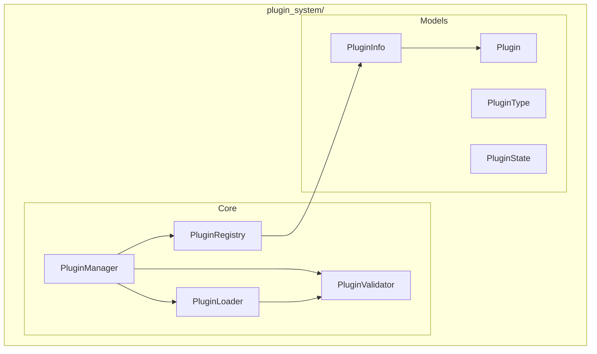
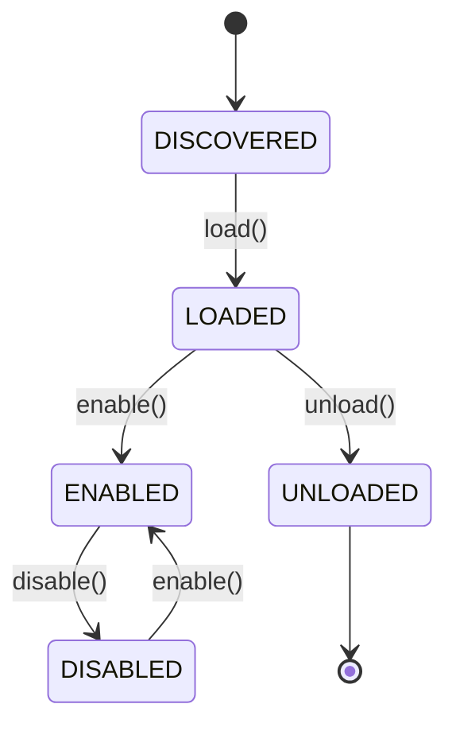

# Plugin System Module

**Version**: v0.1.0 | **Status**: Active | **Last Updated**: January 2026

## Overview

The Plugin System module provides a plugin architecture that allows extending Codomyrmex functionality through third-party plugins. It handles plugin discovery, loading, validation, lifecycle management, and dependency resolution.

## Architecture



## Key Classes

| Class | Purpose |
|-------|---------|
| `PluginManager` | Main orchestrator for plugin lifecycle |
| `PluginLoader` | Discover and load plugins |
| `PluginValidator` | Validate plugin structure and compatibility |
| `PluginRegistry` | Store and lookup registered plugins |
| `Plugin` | Base class for plugins |
| `PluginInfo` | Plugin metadata container |
| `PluginType` | Enum of plugin types |
| `PluginState` | Enum of plugin states |

## Exceptions

| Exception | When Raised |
|-----------|-------------|
| `PluginError` | Base plugin exception |
| `LoadError` | Plugin loading failure |
| `DependencyError` | Missing plugin dependencies |
| `HookError` | Hook registration/execution error |
| `PluginValidationError` | Plugin validation failure |
| `PluginStateError` | Invalid state transition |
| `PluginConflictError` | Conflicting plugins detected |

## Quick Start

### Load and Enable Plugins

```python
from codomyrmex.plugin_system import PluginManager

manager = PluginManager()

# Discover plugins in directory
manager.discover("plugins/")

# Enable a specific plugin
manager.enable("my-plugin")

# List all plugins
for plugin in manager.list_plugins():
    print(f"{plugin.name}: {plugin.state}")
```

### Creating a Plugin

```python
from codomyrmex.plugin_system import Plugin, PluginInfo

class MyPlugin(Plugin):
    @property
    def info(self) -> PluginInfo:
        return PluginInfo(
            name="my-plugin",
            version="1.0.0",
            author="Developer",
            description="My custom plugin"
        )
    
    def on_enable(self):
        print("Plugin enabled!")
    
    def on_disable(self):
        print("Plugin disabled!")
```

### Plugin Validation

```python
from codomyrmex.plugin_system import PluginValidator

validator = PluginValidator()

# Validate plugin structure
result = validator.validate("plugins/my-plugin/")

if result.is_valid:
    print("Plugin is valid")
else:
    for error in result.errors:
        print(f"Error: {error}")
```

### Plugin Registry

```python
from codomyrmex.plugin_system import PluginRegistry

registry = PluginRegistry()

# Register a plugin
registry.register(my_plugin)

# Lookup by name
plugin = registry.get("my-plugin")

# Get by type
agent_plugins = registry.get_by_type(PluginType.AGENT)
```

## Plugin Types

| Type | Description |
|------|-------------|
| `AGENT` | AI agent extensions |
| `TOOL` | Development tools |
| `FORMATTER` | Output formatters |
| `INTEGRATION` | Third-party integrations |

## Plugin States



## Integration Points

- **agents**: Agent-type plugins
- **logging_monitoring**: Plugin logging
- **config_management**: Plugin configuration

## Navigation

- **Parent**: [../README.md](../README.md)
- **Siblings**: [agents](../agents/), [config_management](../config_management/)
- **Spec**: [SPEC.md](SPEC.md)
