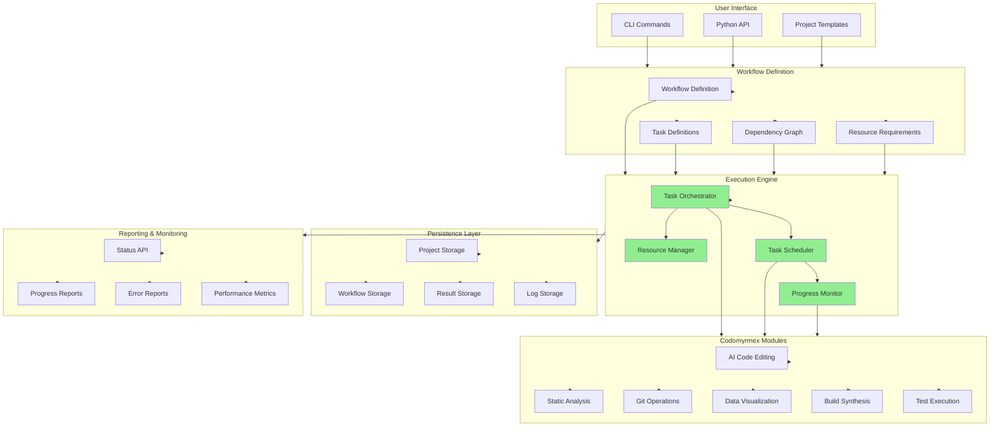

# src/codomyrmex/project_orchestration

**Version**: v0.1.0 | **Status**: Active | **Last Updated**: December 2025

## Overview

Core module providing project management and workflow orchestration capabilities for the Codomyrmex platform. This module enables coordination of complex workflows that integrate multiple Codomyrmex modules into cohesive, automated processes.

## Workflow Orchestration Architecture

## Key Features

- **Workflow Definition**: Create complex multi-step workflows with dependencies
- **Task Orchestration**: Coordinate individual tasks across multiple modules
- **Resource Management**: Allocate and monitor shared resources
- **Project Templates**: Automated project scaffolding with documentation
- **Progress Tracking**: Real-time monitoring of workflow execution
- **Error Recovery**: Robust error handling and recovery mechanisms
- **Parallel Execution**: Support for concurrent task processing

## Directory Contents
- `API_SPECIFICATION.md` – File
- `CHANGELOG.md` – File
- `COMPREHENSIVE_API_DOCUMENTATION.md` – File
- `DEVELOPER_GUIDE.md` – File
- `MCP_TOOL_SPECIFICATION.md` – File
- `SECURITY.md` – File
- `USAGE_EXAMPLES.md` – File
- `__init__.py` – File
- `documentation_generator.py` – File
- `mcp_tools.py` – File
- `orchestration_engine.py` – File
- `project_manager.py` – File
- `resource_manager.py` – File
- `task_orchestrator.py` – File
- `templates/` – Subdirectory
- `tests/` – Subdirectory
- `workflow_manager.py` – File

## Navigation
- **Project Root**: [README](../../../README.md)
- **Parent Directory**: [codomyrmex](../README.md)
- **Src Hub**: [src](../../../src/README.md)
