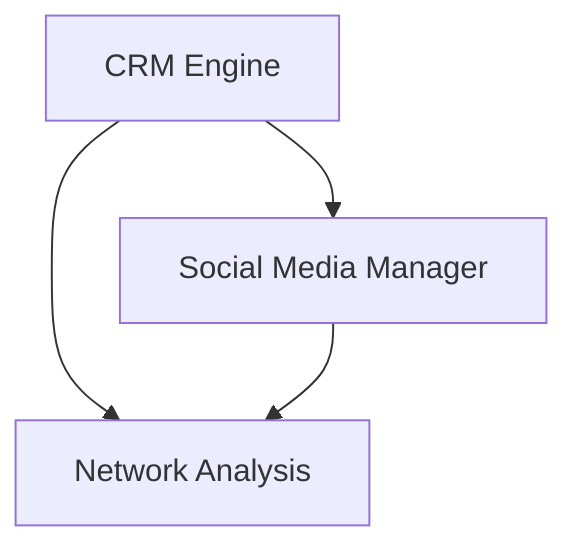

# Relations - Functional Specification

**Version**: v0.1.0 | **Status**: Active | **Last Updated**: February 2026

## Purpose

Maintain and optimize the agent's social graph, managing external relationships and platform presence.

## Design Principles

### Relationship-Centric

- All data is keyed by entity (person, organization)
- Interactions are immutable history

### Multi-Channel

- Unifies email, social media, and chat interactions

## Architecture

## Functional Requirements

1. **CRM**: Store and retrieve contact details and history.
2. **Social Media**: Post updates and monitor replies.
3. **Network Analysis**: Identify key influencers and connection paths.

## Interface Contracts

- `CRM.get_contact(id)`
- `SocialManager.post(content, platforms)`
- `Graph.analyze_centrality()`

## Navigation

- [README](README.md) | [AGENTS](AGENTS.md) | [Parent](../SPEC.md)
