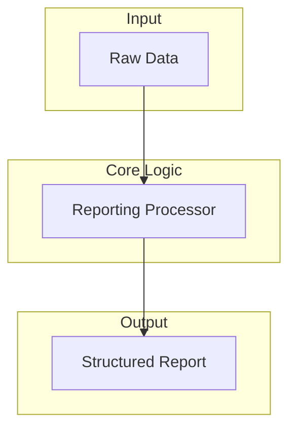

# reporting - Functional Specification

**Version**: v1.0.0 | **Status**: Active | **Last Updated**: February 2026

## Purpose

The `reporting` module provides reporting generation and processing capabilities for Codomyrmex.

## Design Principles

### Modularity

- **Loose Coupling**: Reporting logic must not depend heavily on specific underlying subsystems.

### Functional Isolation

- **Independent Logic**: Data ingestion and the ultimate reporting formats are separated.

### Parsimony

- **Simple Inputs**: Designed to work cleanly using standard MCP tool conventions and simple string data.

### Functionality

- **Stateless Operation**: Generation focuses on current input states and does not rely on mutable global configurations.

## Architecture

## Functional Requirements

### Core Capabilities

1. **Ingestion**: Accepts string input data for report compilation.
2. **Structuring**: Wraps the data into a standardized dictionary output format.

### Quality Standards

- **Consistency**: Output dictionary must contain predictable top-level keys (`status`, `report`).

## Interface Contracts

### Public API

- `Reporting.process(data: Any) -> dict[str, Any]`: Processes data into a dict.
- `reporting_process(data: str) -> dict[str, Any]`: MCP tool exposing processing capability.

### Dependencies

- **Internal**: `codomyrmex.logging_monitoring`.

## Implementation Guidelines

### Usage Patterns

- Use through MCP tool invocation (`reporting_process`).
- Import and use `create_reporting()` natively.

## Navigation

- **Human Documentation**: [README.md](README.md)
- **Technical Documentation**: [AGENTS.md](AGENTS.md)
- **Package SPEC**: [../SPEC.md](../SPEC.md)
