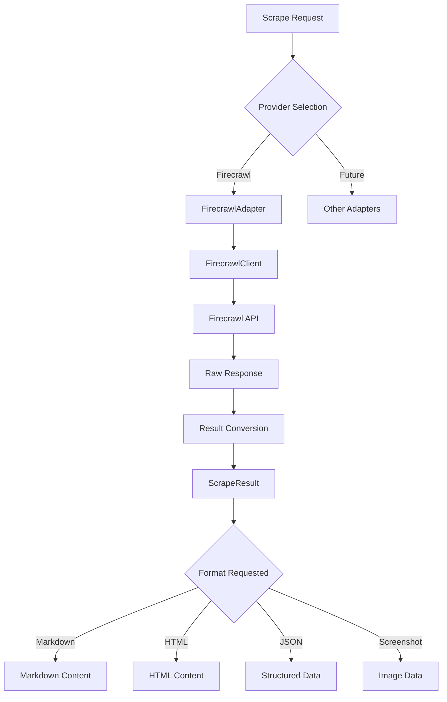

# Scrape Module

## Signposting
- **Parent**: [codomyrmex](../README.md)
- **Children**:
    - [firecrawl](firecrawl/README.md) - Firecrawl integration
    - [docs](../../../docs/README.md) - Additional documentation
- **Key Artifacts**:
    - [Agent Guide](AGENTS.md)
    - [Functional Spec](SPEC.md)

**Version**: v0.1.0 | **Status**: Active | **Last Updated**: December 2025

## Overview

Core Layer module providing web scraping capabilities for the Codomyrmex platform. This module offers a unified interface for scraping web content, crawling websites, mapping site structures, and extracting structured data using AI/LLM.

The scrape module serves as the web data extraction layer, enabling reliable conversion of web content into LLM-ready formats (markdown, HTML, structured JSON) with support for multiple scraping providers.

## Key Features

### Core Capabilities
- **Single URL Scraping**: Scrape individual web pages with multiple format support
- **Website Crawling**: Crawl entire websites and extract content from all accessible pages
- **Site Mapping**: Discover and map the structure of websites
- **Web Search**: Search the web and optionally scrape search results
- **LLM Extraction**: Extract structured data from pages using AI/LLM with schemas
- **Batch Operations**: Process multiple URLs efficiently
- **Dynamic Content**: Support for JavaScript-rendered content with actions (click, scroll, wait)

### Provider Support
- **Firecrawl**: Full integration with Firecrawl service (primary provider)
- **Extensible**: Architecture supports additional providers

## Scraping Workflow



## Quick Start

### Basic Scraping

```python
from codomyrmex.scrape import Scraper, ScrapeOptions, ScrapeFormat

# Initialize scraper (uses Firecrawl by default if API key is set)
scraper = Scraper()

# Scrape a URL
options = ScrapeOptions(formats=[ScrapeFormat.MARKDOWN, ScrapeFormat.HTML])
result = scraper.scrape("https://example.com", options)

print(result.content)  # Markdown content
print(result.formats.get("html"))  # HTML content
print(result.metadata.get("title"))  # Page title
```

### Configuration

```python
from codomyrmex.scrape import Scraper, ScrapeConfig

# Configure with API key
config = ScrapeConfig(api_key="fc-your-api-key")
scraper = Scraper(config=config)

# Or use environment variable
# Set FIRECRAWL_API_KEY environment variable
scraper = Scraper()  # Automatically loads from environment
```

### Crawling a Website

```python
from codomyrmex.scrape import Scraper, ScrapeOptions, ScrapeFormat

scraper = Scraper()

options = ScrapeOptions(
    formats=[ScrapeFormat.MARKDOWN],
    limit=10,  # Maximum pages to crawl
    max_depth=2,  # Maximum crawl depth
)

crawl_result = scraper.crawl("https://example.com", options)

print(f"Crawl job ID: {crawl_result.job_id}")
print(f"Status: {crawl_result.status}")
print(f"Total pages: {crawl_result.total}")

for page_result in crawl_result.results:
    print(f"Scraped: {page_result.url}")
    print(f"Content length: {len(page_result.content)}")
```

### Mapping Website Structure

```python
from codomyrmex.scrape import Scraper

scraper = Scraper()

# Map all links
map_result = scraper.map("https://example.com")
print(f"Found {map_result.total} links")

# Search for specific links
search_result = scraper.map("https://example.com", search="docs")
print(f"Found {search_result.total} matching links")

for link in search_result.links[:10]:
    print(f"{link.get('title', 'No title')}: {link.get('url')}")
```

### Web Search

```python
from codomyrmex.scrape import Scraper, ScrapeOptions, ScrapeFormat

scraper = Scraper()

options = ScrapeOptions(
    formats=[ScrapeFormat.MARKDOWN],
    limit=5,  # Number of results
)

search_result = scraper.search("python web scraping", options)

print(f"Found {search_result.total} results")
for result in search_result.results:
    print(f"{result.url}: {result.metadata.get('title', 'No title')}")
    print(result.content[:200])  # First 200 chars
```

### Extracting Structured Data

```python
from codomyrmex.scrape import Scraper

scraper = Scraper()

# Define schema for extraction
schema = {
    "type": "object",
    "properties": {
        "title": {"type": "string"},
        "description": {"type": "string"},
        "author": {"type": "string"},
        "published_date": {"type": "string"}
    },
    "required": ["title", "description"]
}

# Extract with schema
extract_result = scraper.extract(
    urls=["https://example.com/article"],
    schema=schema,
    prompt="Extract article information"
)

print(extract_result.data)

# Extract without schema (LLM chooses structure)
extract_result = scraper.extract(
    urls=["https://example.com/article"],
    prompt="Extract the main points from this article"
)

print(extract_result.data)
```

## Architecture

### Core Components

1. **Core Abstractions** (`core.py`):
   - `ScrapeResult`: Standard result structure
   - `ScrapeOptions`: Configuration for scraping operations
   - `ScrapeFormat`: Supported output formats
   - `BaseScraper`: Abstract base class for implementations

2. **Main Scraper** (`scraper.py`):
   - `Scraper`: Main interface for scraping operations
   - Delegates to provider-specific adapters
   - Handles configuration and error handling

3. **Configuration** (`config.py`):
   - `ScrapeConfig`: Configuration management
   - Environment variable support
   - Default settings and presets

4. **Exceptions** (`exceptions.py`):
   - Module-specific exception hierarchy
   - Error context and translation

### Provider Integration

The module uses an adapter pattern to support multiple scraping providers:

- **FirecrawlAdapter**: Implements `BaseScraper` using Firecrawl service
- **FirecrawlClient**: Low-level wrapper around Firecrawl SDK

## Configuration

### Environment Variables

- `FIRECRAWL_API_KEY` or `FC_API_KEY`: Firecrawl API key (required)
- `SCRAPE_BASE_URL`: Base URL for API (default: https://api.firecrawl.dev)
- `SCRAPE_TIMEOUT`: Default timeout in seconds (default: 30.0)
- `SCRAPE_MAX_RETRIES`: Maximum retry attempts (default: 3)
- `SCRAPE_RETRY_DELAY`: Delay between retries in seconds (default: 1.0)
- `SCRAPE_RATE_LIMIT`: Rate limit in requests per second (optional)
- `SCRAPE_USER_AGENT`: User agent string (optional)
- `SCRAPE_RESPECT_ROBOTS_TXT`: Whether to respect robots.txt (default: true)

### Programmatic Configuration

```python
from codomyrmex.scrape import ScrapeConfig, set_config

config = ScrapeConfig(
    api_key="fc-your-key",
    default_timeout=60.0,
    max_retries=5,
    respect_robots_txt=True,
)

set_config(config)  # Set as global config
```

## Error Handling

The module provides specific exceptions for different error scenarios:

```python
from codomyrmex.scrape.exceptions import (
    ScrapeError,
    ScrapeConnectionError,
    ScrapeTimeoutError,
    ScrapeValidationError,
    FirecrawlError,
)

try:
    result = scraper.scrape("https://example.com")
except ScrapeValidationError as e:
    print(f"Invalid input: {e}")
except ScrapeConnectionError as e:
    print(f"Connection failed: {e}")
except ScrapeTimeoutError as e:
    print(f"Timeout: {e}")
except FirecrawlError as e:
    print(f"Firecrawl error: {e}")
except ScrapeError as e:
    print(f"Scraping error: {e}")
```

## Dependencies

### Required
- Python 3.10+
- `codomyrmex.logging_monitoring` - For logging

### Optional
- `firecrawl-py` - For Firecrawl integration (install with `pip install firecrawl-py` or `uv sync --extra scrape`)

## Usage Examples

See the [docs](docs/USAGE_EXAMPLES.md) directory for more detailed examples.

## Navigation

- **Technical Docs**: [AGENTS.md](AGENTS.md) - Agent documentation
- **Specification**: [SPEC.md](SPEC.md) - Functional specification
- **Security**: [SECURITY.md](SECURITY.md) - Security considerations
- **Firecrawl Integration**: [firecrawl/README.md](firecrawl/README.md) - Firecrawl submodule
- **API Reference**: [docs/API_SPECIFICATION.md](docs/API_SPECIFICATION.md) - API documentation

