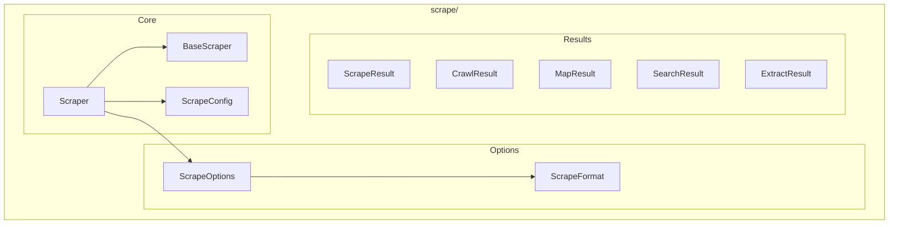

# Scrape Module

**Version**: v0.1.0 | **Status**: Active | **Last Updated**: January 2026

## Overview

The Scrape module provides web scraping capabilities with support for multiple scraping providers. Currently integrated with Firecrawl for advanced scraping, crawling, and content extraction.

## Architecture



## Key Classes

| Class | Purpose |
|-------|---------|
| `Scraper` | Main scraping client |
| `BaseScraper` | Abstract base class |
| `ScrapeConfig` | Configuration container |
| `ScrapeOptions` | Scrape request options |
| `ScrapeFormat` | Output format enum |
| `ScrapeResult` | Single page result |
| `CrawlResult` | Multi-page crawl result |
| `MapResult` | Site map result |
| `SearchResult` | Search result |
| `ExtractResult` | Structured extraction result |

## Scrape Formats

| Format | Description |
|--------|-------------|
| `MARKDOWN` | Clean markdown content |
| `HTML` | Raw HTML content |
| `TEXT` | Plain text |
| `JSON` | Structured JSON |

## Quick Start

### Basic Scraping

```python
from codomyrmex.scrape import Scraper, ScrapeOptions, ScrapeFormat

scraper = Scraper()

# Simple scrape
result = scraper.scrape("https://example.com")
print(result.content)

# With options
options = ScrapeOptions(formats=[ScrapeFormat.MARKDOWN, ScrapeFormat.HTML])
result = scraper.scrape("https://docs.python.org", options)
print(result.markdown)
```

### Crawling

```python
from codomyrmex.scrape import Scraper

scraper = Scraper()

# Crawl entire site
result = scraper.crawl(
    "https://example.com",
    max_pages=100,
    include_patterns=["/docs/*"]
)

for page in result.pages:
    print(f"{page.url}: {len(page.content)} chars")
```

### Site Mapping

```python
from codomyrmex.scrape import Scraper

scraper = Scraper()

# Get site structure
sitemap = scraper.map("https://example.com")

for url in sitemap.urls:
    print(url)
```

### Structured Extraction

```python
from codomyrmex.scrape import Scraper

scraper = Scraper()

# Extract structured data
result = scraper.extract(
    "https://example.com/products",
    schema={
        "name": "string",
        "price": "number",
        "description": "string"
    }
)

for item in result.items:
    print(f"{item['name']}: ${item['price']}")
```

### Configuration

```python
from codomyrmex.scrape import get_config, set_config, ScrapeConfig

# Get current config
config = get_config()

# Update config
set_config(ScrapeConfig(
    api_key="your-firecrawl-key",
    timeout=30,
    max_retries=3
))
```

## Exceptions

| Exception | When Raised |
|-----------|-------------|
| `ScrapeError` | General scraping error |
| `ScrapeConnectionError` | Connection failure |
| `ScrapeTimeoutError` | Request timeout |
| `ScrapeValidationError` | Invalid parameters |
| `FirecrawlError` | Firecrawl API error |

## Integration Points

- **networking**: HTTP client infrastructure
- **cache**: Cache scraped content
- **llm**: Process scraped content with LLMs

## Navigation

- **Parent**: [../README.md](../README.md)
- **Siblings**: [networking](../networking/), [documents](../documents/)
- **Spec**: [SPEC.md](SPEC.md)
