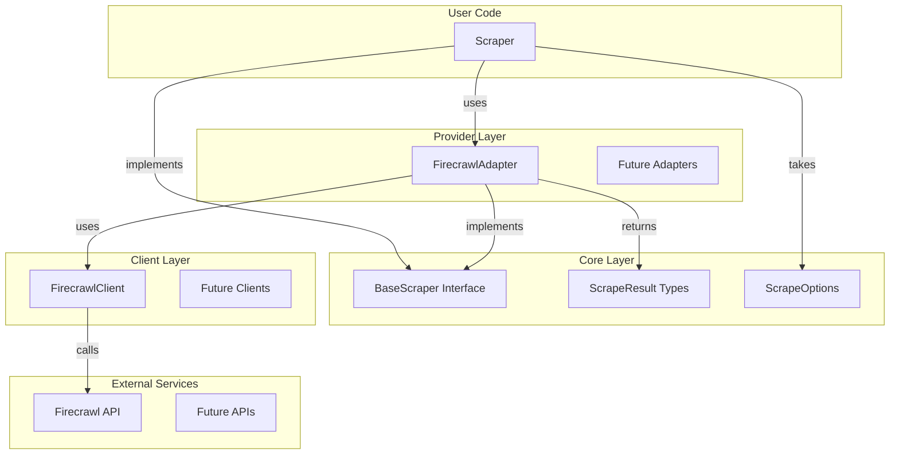

# scrape - Functional Specification

**Version**: v0.1.0 | **Status**: Active | **Last Updated**: February 2026

## Purpose

The `scrape` module is the web data extraction engine of Codomyrmex. It provides a unified interface for scraping web content, crawling websites, mapping site structures, and extracting structured data. It abstracts the complexities of different scraping providers (e.g., Firecrawl) behind a consistent Pythonic interface.

## Design Principles

### Modularity

- **Provider Abstraction**: `BaseScraper` interface allows multiple provider implementations
- **Adapter Pattern**: Provider-specific adapters (e.g., `FirecrawlAdapter`) implement the core interface
- **Pluggable Architecture**: Easy to add new scraping providers without changing core code

### Type Safety

- **Strong Typing**: All methods use type hints
- **Structured Results**: Standard result types (ScrapeResult, CrawlResult, etc.)
- **Input Validation**: Validation at API boundaries

### Parsimony

- **No Reinvention**: Wraps existing services (Firecrawl) rather than reimplementing scraping logic
- **Minimal State**: Configuration is externalized, operations are stateless where possible
- **Clear Abstractions**: Simple, focused interfaces

### Functionality

- **Multiple Formats**: Support for markdown, HTML, JSON, screenshots, metadata
- **Batch Operations**: Efficient processing of multiple URLs
- **Dynamic Content**: Support for JavaScript-rendered content
- **LLM Integration**: AI-powered structured data extraction

### Testing

- **Unit Tests**: Test core abstractions and adapters
- **Integration Tests**: Test end-to-end workflows (with controlled real URLs)
- **Error Cases**: Comprehensive error handling tests

## Architecture



## Functional Requirements

### Core Capabilities

1. **Single URL Scraping**
   - Scrape individual web pages
   - Support multiple output formats (markdown, HTML, JSON, etc.)
   - Handle dynamic content with actions (click, scroll, wait)
   - Extract metadata (title, description, etc.)

2. **Website Crawling**
   - Crawl entire websites starting from a URL
   - Control crawl depth and page limits
   - Respect robots.txt (configurable)
   - Return structured results for all pages

3. **Site Mapping**
   - Discover all links on a website
   - Filter links by search term
   - Return link metadata (title, description, URL)

4. **Web Search**
   - Search the web with queries
   - Optionally scrape search results
   - Control number of results
   - Return search results with content

5. **LLM Extraction**
   - Extract structured data from URLs using AI/LLM
   - Support JSON schema definitions
   - Support prompt-based extraction
   - Handle multiple URLs (including wildcards)

### Quality Standards

- **Reliability**: Robust error handling and retry logic
- **Performance**: Efficient batch operations and parallel processing where possible
- **Security**: API key management, rate limiting, robots.txt respect
- **Documentation**: Comprehensive API documentation and examples

## Interface Contracts

### Public API

```python
# Main interface
scraper = Scraper(config: Optional[ScrapeConfig] = None)

# Scraping
result: ScrapeResult = scraper.scrape(url: str, options: Optional[ScrapeOptions] = None)

# Crawling
crawl_result: CrawlResult = scraper.crawl(url: str, options: Optional[ScrapeOptions] = None)

# Mapping
map_result: MapResult = scraper.map(url: str, search: Optional[str] = None)

# Searching
search_result: SearchResult = scraper.search(query: str, options: Optional[ScrapeOptions] = None)

# Extraction
extract_result: ExtractResult = scraper.extract(
    urls: List[str],
    schema: Optional[Dict[str, Any]] = None,
    prompt: Optional[str] = None
)
```

### Data Structures

```python
@dataclass
class ScrapeResult:
    url: str
    content: str
    formats: Dict[str, Any]
    metadata: Dict[str, Any]
    status_code: Optional[int]
    success: bool
    error: Optional[str]

@dataclass
class ScrapeOptions:
    formats: List[ScrapeFormat | str]
    timeout: Optional[float]
    headers: Dict[str, str]
    actions: List[Dict[str, Any]]
    max_depth: Optional[int]
    limit: Optional[int]
    follow_links: bool
    respect_robots_txt: bool
```

### Exceptions

```python
class ScrapeError(CodomyrmexError): ...
class ScrapeConnectionError(ScrapeError): ...
class ScrapeTimeoutError(ScrapeError): ...
class ScrapeValidationError(ScrapeError): ...
class FirecrawlError(ScrapeError): ...
```

## Dependencies

### Internal

- `codomyrmex.logging_monitoring` - For logging
- `codomyrmex.exceptions` - Base exception classes

### External

- `firecrawl-py` - Firecrawl Python SDK (optional, for Firecrawl provider)

## Testing Strategy

1. **Unit Tests**: Test core abstractions, data structures, configuration with real implementations
2. **Adapter Tests**: Test FirecrawlAdapter with real FirecrawlClient (skipped if firecrawl-py unavailable)
3. **Integration Tests**: Test end-to-end with real URLs and API calls (when API key available)
4. **Error Tests**: Test error handling and exception translation with real error propagation

## Future Enhancements

- Additional provider adapters (e.g., Scrapy, BeautifulSoup)
- Caching layer for scraped content
- Rate limiting and throttling
- Proxy support
- Custom user agents and headers per request
- Content filtering and transformation pipelines

## Navigation

- **Human Documentation**: [README.md](README.md)
- **Technical Documentation**: [AGENTS.md](AGENTS.md)
- **Functional Specification**: [SPEC.md](SPEC.md)
- **Parent Directory**: [codomyrmex](../README.md)
- **Repository Root**: [../../../README.md](../../../README.md)
- **Repository SPEC**: [../../../SPEC.md](../../../SPEC.md)

<!-- Navigation Links keyword for score -->
