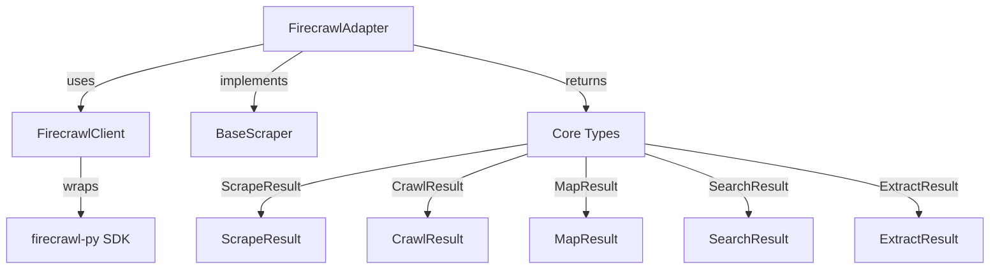

# Firecrawl Integration - Functional Specification

**Version**: v0.1.0 | **Status**: Active | **Last Updated**: December 2025

## Purpose

The Firecrawl integration submodule provides a typed, Pythonic interface to the Firecrawl web scraping service. It wraps the Firecrawl Python SDK and adapts it to work seamlessly with the core scraping abstractions.

## Design Principles

### Type Safety
- All methods use type hints
- Return types match core abstractions
- Input validation at adapter level

### Error Handling
- Firecrawl SDK errors translated to module exceptions
- Connection errors → `ScrapeConnectionError`
- Timeout errors → `ScrapeTimeoutError`
- Other errors → `FirecrawlError`

### Abstraction
- Low-level client (`FirecrawlClient`) wraps SDK directly
- High-level adapter (`FirecrawlAdapter`) implements core interface
- Clear separation of concerns

## Architecture



## Functional Requirements

### FirecrawlClient

1. **Initialization**
   - Accepts `ScrapeConfig` with API key
   - Validates configuration
   - Initializes Firecrawl SDK client
   - Raises `FirecrawlError` if SDK not installed

2. **Scraping**
   - `scrape_url()`: Scrape single URL with format support
   - Handles actions (click, scroll, wait)
   - Returns raw Firecrawl response dict

3. **Crawling**
   - `crawl_url()`: Start crawl job
   - Supports limit and scrape options
   - Returns crawl job information

4. **Mapping**
   - `map_url()`: Map website structure
   - Supports search filtering
   - Returns links with metadata

5. **Searching**
   - `search_web()`: Search the web
   - Supports result scraping
   - Returns search results

6. **Extraction**
   - `extract_data()`: Extract structured data
   - Supports schema and prompt
   - Returns extracted data

### FirecrawlAdapter

1. **Interface Implementation**
   - Implements all `BaseScraper` methods
   - Converts Firecrawl responses to core types
   - Handles format conversions

2. **Result Conversion**
   - `_convert_scrape_result()`: Document/dict → ScrapeResult
   - `_convert_crawl_result()`: Crawl response → CrawlResult
   - `_convert_map_result()`: Map response → MapResult
   - `_convert_search_result()`: Search response → SearchResult
   - `_convert_extract_result()`: Extract response → ExtractResult

3. **Error Handling**
   - Catches Firecrawl SDK errors
   - Translates to module exceptions
   - Preserves error context

## Interface Contracts

### FirecrawlClient

```python
class FirecrawlClient:
    def __init__(self, config: ScrapeConfig) -> None
    def scrape_url(url: str, formats: Optional[List[str]] = None, ...) -> Dict[str, Any]
    def crawl_url(url: str, limit: Optional[int] = None, ...) -> Dict[str, Any]
    def map_url(url: str, search: Optional[str] = None) -> Dict[str, Any]
    def search_web(query: str, limit: Optional[int] = None, ...) -> Dict[str, Any]
    def extract_data(urls: List[str], schema: Optional[Dict] = None, ...) -> Dict[str, Any]
```

### FirecrawlAdapter

```python
class FirecrawlAdapter(BaseScraper):
    def __init__(self, config: Optional[ScrapeConfig] = None) -> None
    def scrape(url: str, options: Optional[ScrapeOptions] = None) -> ScrapeResult
    def crawl(url: str, options: Optional[ScrapeOptions] = None) -> CrawlResult
    def map(url: str, search: Optional[str] = None) -> MapResult
    def search(query: str, options: Optional[ScrapeOptions] = None) -> SearchResult
    def extract(urls: List[str], schema: Optional[Dict] = None, ...) -> ExtractResult
```

## Dependencies

- **External**: `firecrawl-py` Python package
- **Internal**: Core scraping abstractions, configuration, exceptions

## Quality Standards

- Type hints on all public methods
- Error translation for all SDK errors
- Logging for all operations
- Support for all Firecrawl features (scrape, crawl, map, search, extract)

## Testing Requirements

- Unit tests for client wrapper (real SDK when available, skipped otherwise)
- Unit tests for adapter conversion methods (real data structures)
- Integration tests with real Firecrawl SDK (when API key available)
- Error handling test cases (real error propagation)

## Navigation

- **Human Documentation**: [README.md](README.md)
- **Technical Documentation**: [AGENTS.md](AGENTS.md)
- **Functional Specification**: [SPEC.md](SPEC.md)
- **Parent Directory**: [scrape](../README.md)
- **Repository Root**: [../../../../README.md](../../../../README.md)
- **Repository SPEC**: [../../../../SPEC.md](../../../../SPEC.md)
