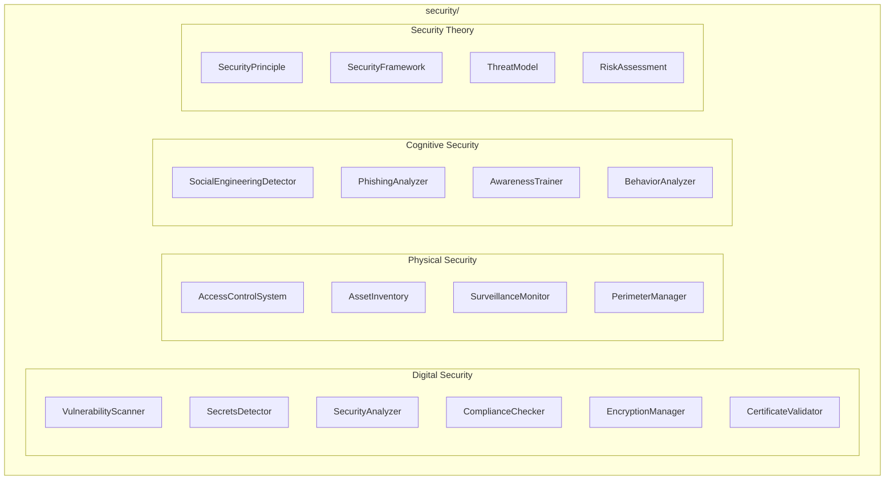

# Security Module

**Version**: v0.1.0 | **Status**: Active | **Last Updated**: January 2026

## Overview

The Security module provides comprehensive security capabilities for the Codomyrmex platform, organized into four specialized submodules: digital security, physical security, cognitive security, and security theory.

## Architecture



## Submodules

### Digital Security

| Class | Purpose |
|-------|---------|
| `VulnerabilityScanner` | Scan for code vulnerabilities |
| `SecretsDetector` | Detect exposed secrets |
| `SecurityAnalyzer` | Comprehensive security analysis |
| `ComplianceChecker` | Compliance verification |
| `EncryptionManager` | Data encryption |
| `CertificateValidator` | SSL/TLS validation |
| `SecurityMonitor` | Event monitoring |
| `SecurityReportGenerator` | Generate reports |

### Physical Security

| Class | Purpose |
|-------|---------|
| `AccessControlSystem` | Physical access control |
| `AssetInventory` | Asset tracking |
| `SurveillanceMonitor` | Physical monitoring |
| `PerimeterManager` | Perimeter security |

### Cognitive Security

| Class | Purpose |
|-------|---------|
| `SocialEngineeringDetector` | Detect social engineering |
| `PhishingAnalyzer` | Analyze phishing attempts |
| `AwarenessTrainer` | Security training |
| `BehaviorAnalyzer` | User behavior analysis |

### Security Theory

| Class | Purpose |
|-------|---------|
| `SecurityPrinciple` | Security principles |
| `SecurityFramework` | Security frameworks |
| `ThreatModel` | Threat modeling |
| `RiskAssessment` | Risk assessment |

## Quick Start

### Vulnerability Scanning

```python
from codomyrmex.security import VulnerabilityScanner, scan_vulnerabilities

scanner = VulnerabilityScanner()
report = scan_vulnerabilities("src/")

for vuln in report.vulnerabilities:
    print(f"[{vuln.severity}] {vuln.description}")
    print(f"  Location: {vuln.file}:{vuln.line}")
```

### Secrets Detection

```python
from codomyrmex.security import SecretsDetector, scan_directory_for_secrets

detector = SecretsDetector()
secrets = scan_directory_for_secrets("src/", patterns=["api_key", "password"])

for secret in secrets:
    print(f"Potential secret in {secret.file}: {secret.pattern}")
```

### Compliance Checking

```python
from codomyrmex.security import (
    ComplianceChecker,
    ComplianceStandard,
    check_compliance
)

result = check_compliance(
    target="src/",
    standard=ComplianceStandard.OWASP_TOP_10
)

print(f"Compliance score: {result.score:.1%}")
for issue in result.issues:
    print(f"  - {issue.description}")
```

### Threat Modeling

```python
from codomyrmex.security import ThreatModel, create_threat_model

model = create_threat_model(
    system_name="MyApp",
    components=["api", "database", "auth"],
    data_flows=[("api", "database"), ("auth", "api")]
)

threats = model.analyze_threats()
for threat in threats:
    print(f"Threat: {threat.name} - Risk: {threat.risk_level}")
```

### Risk Assessment

```python
from codomyrmex.security import RiskAssessment, assess_risk

assessment = assess_risk(
    asset="customer_database",
    threats=["sql_injection", "data_breach"],
    controls=["parameterized_queries", "encryption"]
)

print(f"Risk score: {assessment.score}")
print(f"Recommendation: {assessment.recommendation}")
```

## Integration Points

- **logging_monitoring**: Security event logging
- **static_analysis**: Code security analysis
- **encryption**: Data protection
- **auth**: Authentication integration

## Navigation

- **Parent**: [../README.md](../README.md)
- **Siblings**: [auth](../auth/), [encryption](../encryption/)
- **Spec**: [SPEC.md](SPEC.md)
