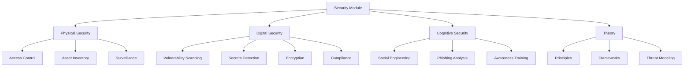

# src/codomyrmex/security

## Signposting
- **Parent**: [codomyrmex](../README.md)
- **Children**:
    - [physical](physical/)
    - [digital](digital/)
    - [cognitive](cognitive/)
    - [theory](theory/)
- **Key Artifacts**:
    - [Agent Guide](AGENTS.md)
    - [Functional Spec](SPEC.md)

**Version**: v0.1.0 | **Status**: Active | **Last Updated**: December 2025

## Overview

The Security module provides comprehensive security capabilities organized into four specialized submodules:

- **Physical Security** (`physical/`): Physical security practices, access control, surveillance, physical asset protection
- **Digital Security** (`digital/`): Digital security practices - vulnerability scanning, code security analysis, secrets detection, encryption, certificate validation, compliance checking, security monitoring, and reporting
- **Cognitive Security** (`cognitive/`): Cognitive security practices, social engineering defense, phishing detection and analysis, security awareness training, cognitive threat assessment, and human factor security analysis
- **Theory** (`theory/`): Generic security considerations, principles, frameworks, threat modeling methodologies, risk assessment methods, security architecture patterns, and security best practices

## Security Architecture



## Submodules

### Physical Security

Physical security practices including:
- Access control systems
- Physical asset inventory
- Surveillance monitoring
- Physical vulnerability assessment
- Security perimeter management

### Digital Security

Digital security practices (formerly security.digital):
- Vulnerability scanning
- Code security analysis
- Secrets detection
- Encryption management
- Certificate validation
- Compliance checking
- Security monitoring
- Security reporting

### Cognitive Security

Cognitive security practices:
- Social engineering detection
- Phishing detection and analysis
- Security awareness training
- Cognitive threat assessment
- Human factor security analysis
- Security behavior analysis

### Security Theory

Generic security considerations:
- Security principles and frameworks
- Threat modeling
- Risk assessment methodologies
- Security architecture patterns
- Security best practices
- Security standards and compliance frameworks

## Directory Contents

- `__init__.py` – Unified security API
- `physical/` – Physical security submodule
- `digital/` – Digital security submodule
- `cognitive/` – Cognitive security submodule
- `theory/` – Security theory submodule
- `docs/` – Additional documentation
- `tests/` – Test suite

## Integration

The Security module integrates with:

- **Logging Monitoring** - Uses centralized logging system
- **Environment Setup** - Relies on environment validation
- **Static Analysis** - Integrates for code security analysis

## Navigation

- **Project Root**: [README](../../../README.md)
- **Parent Directory**: [codomyrmex](../README.md)
- **Source Root**: [src](../../README.md)
- **Digital Security**: [digital/README.md](digital/README.md)
- **Physical Security**: [physical/](physical/)
- **Cognitive Security**: [cognitive/](cognitive/)
- **Theory**: [theory/](theory/)


## Getting Started

To use this module in your project, import the necessary components:

```python
# Example usage
from codomyrmex.codomyrmex.security import main_component

def example():
    result = main_component.process()
    print(f"Result: {result}")
```

## detailed_overview

This module is a critical part of the Codomyrmex ecosystem. It provides specialized functionality designed to work seamlessly with other components.
The architecture focuses on modularity, reliability, and performance.

## Contributing

We welcome contributions! Please ensure you:
1.  Follow the project coding standards.
2.  Add tests for new functionality.
3.  Update documentation as needed.

See the root `CONTRIBUTING.md` for more details.

<!-- Navigation Links keyword for score -->
