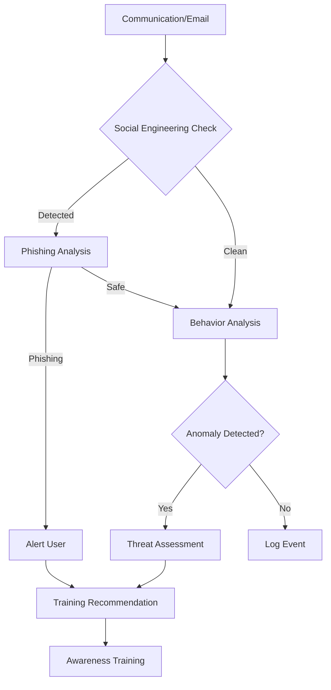

# src/codomyrmex/security/cognitive

## Signposting
- **Parent**: [security](../README.md)
- **Children**:
    - None
- **Key Artifacts**:
    - [Agent Guide](AGENTS.md)
    - [Functional Spec](SPEC.md)

**Version**: v0.1.0 | **Status**: Active | **Last Updated**: December 2025

## Overview

The Cognitive Security submodule provides cognitive security practices, social engineering defense, phishing detection and analysis, security awareness training, cognitive threat assessment, and human factor security analysis for the Codomyrmex platform.

This submodule addresses the human element of security, focusing on protecting against social engineering, phishing, and other cognitive-based attacks.

## Cognitive Security Workflow



The cognitive security workflow analyzes communications, detects threats, assesses risks, and provides training to improve security awareness.

## Core Capabilities

### Social Engineering Detection

Detect social engineering attempts:

```python
from codomyrmex.security.cognitive import detect_social_engineering, analyze_communication

# Detect indicators
indicators = detect_social_engineering(
    "URGENT: Your account will be closed. Click here immediately!"
)

# Full analysis
analysis = analyze_communication(
    "This is an urgent request for your password..."
)
print(f"Risk score: {analysis['risk_score']}")
print(f"Indicators: {len(analysis['indicators'])}")
```

### Phishing Analysis

Analyze emails for phishing:

```python
from codomyrmex.security.cognitive import analyze_email, detect_phishing_attempt

# Analyze email
analysis = analyze_email(
    email_content="Click here to verify your account: http://fake-bank.com",
    sender="noreply@fake-bank.com"
)

if analysis.is_phishing:
    print(f"Phishing detected! Confidence: {analysis.confidence}")
    print(f"Risk level: {analysis.risk_level}")
    print(f"Recommendation: {analysis.recommendation}")

# Quick check
is_phishing = detect_phishing_attempt(email_content, sender)
```

### Awareness Training

Create and manage training modules:

```python
from codomyrmex.security.cognitive import create_training_module, assess_training_effectiveness

# Create training module
module = create_training_module(
    module_id="phishing-101",
    title="Phishing Awareness",
    description="Learn to identify phishing attempts",
    content="Phishing emails often contain...",
    difficulty="beginner"
)

# Assess effectiveness
effectiveness = assess_training_effectiveness("user123")
print(f"Modules completed: {effectiveness['modules_completed']}")
print(f"Average score: {effectiveness['average_score']}")
print(f"Effectiveness: {effectiveness['effectiveness']}")
```

### Cognitive Threat Assessment

Assess cognitive security threats:

```python
from codomyrmex.security.cognitive import assess_cognitive_threats, evaluate_human_factors

# Assess threats
context = {
    "environment": "remote_work",
    "training_level": "low"
}
assessment = assess_cognitive_threats(context)
print(f"Total threats: {assessment['total_threats']}")
print(f"Critical: {assessment['critical_count']}")

# Evaluate human factors
scenario = {
    "training_level": "intermediate",
    "experience": "high",
    "stress_level": "medium"
}
factors = evaluate_human_factors(scenario)
```

### Behavior Analysis

Analyze user behavior:

```python
from codomyrmex.security.cognitive import analyze_user_behavior, detect_anomalous_behavior

# Analyze behavior
behavior_data = {
    "login_time": "02:00",
    "location": "unusual",
    "actions": ["sensitive_access"]
}
patterns = analyze_user_behavior("user123", behavior_data)

# Detect anomalies
anomalies = detect_anomalous_behavior("user123", behavior_data)
for anomaly in anomalies:
    print(f"Anomaly: {anomaly.anomaly_type}, Severity: {anomaly.severity}")
```

## Directory Contents

- `__init__.py` – Module initialization and public API
- `social_engineering_detector.py` – Social engineering detection
- `phishing_analyzer.py` – Phishing email analysis
- `awareness_training.py` – Security awareness training
- `cognitive_threat_assessment.py` – Cognitive threat assessment
- `behavior_analysis.py` – User behavior analysis

## Integration

The Cognitive Security submodule integrates with:

- **Security Module** - Part of comprehensive security framework
- **Logging Monitoring** - Uses centralized logging system
- **Physical Security** - Complements physical security measures
- **Digital Security** - Works with digital security assessments

## Use Cases

### Phishing Protection

Protect users from phishing attacks:
- Analyze incoming emails
- Detect phishing indicators
- Alert users to threats
- Provide remediation guidance

### Social Engineering Defense

Defend against social engineering:
- Analyze communications
- Detect manipulation tactics
- Assess risk levels
- Provide training

### Security Awareness

Improve security awareness:
- Create training modules
- Assess training effectiveness
- Track user progress
- Provide personalized recommendations

### Threat Assessment

Assess cognitive threats:
- Evaluate human factors
- Identify vulnerabilities
- Prioritize risks
- Recommend mitigations

## Navigation

- **Project Root**: [README](../../../../README.md)
- **Parent Directory**: [security](../README.md)
- **Source Root**: [src](../../../../README.md)
- **Agent Guide**: [AGENTS.md](AGENTS.md)
- **Functional Spec**: [SPEC.md](SPEC.md)


## Getting Started

To use this module in your project, import the necessary components:

```python
# Example usage
from codomyrmex.codomyrmex.security.cognitive import main_component

def example():
    result = main_component.process()
    print(f"Result: {result}")
```

## detailed_overview

This module is a critical part of the Codomyrmex ecosystem. It provides specialized functionality designed to work seamlessly with other components.
The architecture focuses on modularity, reliability, and performance.

## Contributing

We welcome contributions! Please ensure you:
1.  Follow the project coding standards.
2.  Add tests for new functionality.
3.  Update documentation as needed.

See the root `CONTRIBUTING.md` for more details.

<!-- Navigation Links keyword for score -->
