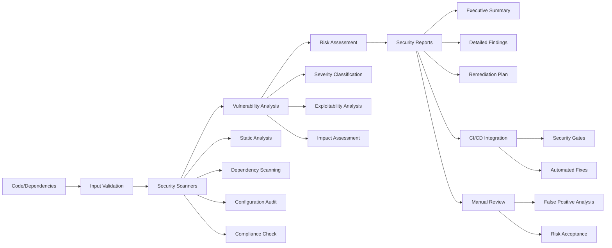

# src/codomyrmex/security/digital

## Signposting
- **Parent**: [security](../README.md)
- **Children**:
    - None
- **Key Artifacts**:
    - [Agent Guide](AGENTS.md)
    - [Functional Spec](SPEC.md)

**Version**: v0.1.0 | **Status**: Active | **Last Updated**: December 2025

## Overview

The Digital Security submodule provides security auditing and vulnerability assessment capabilities for the Codomyrmex platform. This submodule performs automated security scanning, compliance checking, and risk analysis across codebases, dependencies, and configurations.

The digital security submodule serves as the digital security foundation, enabling proactive identification and mitigation of security risks throughout the platform.

## Security Scanning Workflow



The security scanning workflow provides comprehensive security assessment through multiple analysis layers, from automated scanning to detailed reporting and remediation planning.

## Directory Contents
- `API_SPECIFICATION.md` – File
- `SECURITY.md` – File
- `__init__.py` – File
- `certificate_validator.py` – File
- `encryption_manager.py` – File
- `requirements.txt` – File
- `security_monitor.py` – File
- `security_reports.py` – File
- `vulnerability_scanner.py` – File

## Navigation
- **Project Root**: [README](../../../README.md)
- **Parent Directory**: [codomyrmex](../README.md)
- **Source Hub**: [src](../../../../src/README.md)

## Getting Started

To use this module in your project, import the necessary components:

```python
# Example usage
from codomyrmex.codomyrmex.security.digital import main_component

def example():
    result = main_component.process()
    print(f"Result: {result}")
```

## detailed_overview

This module is a critical part of the Codomyrmex ecosystem. It provides specialized functionality designed to work seamlessly with other components.
The architecture focuses on modularity, reliability, and performance.

## Contributing

We welcome contributions! Please ensure you:
1.  Follow the project coding standards.
2.  Add tests for new functionality.
3.  Update documentation as needed.

See the root `CONTRIBUTING.md` for more details.

<!-- Navigation Links keyword for score -->
