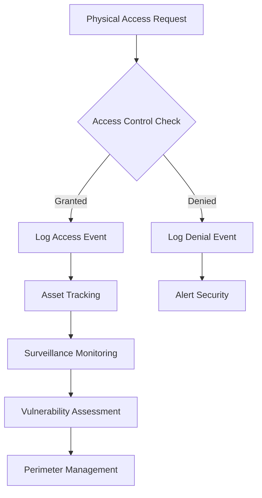

# src/codomyrmex/security/physical

## Signposting
- **Parent**: [security](../README.md)
- **Children**:
    - None
- **Key Artifacts**:
    - [Agent Guide](AGENTS.md)
    - [Functional Spec](SPEC.md)

**Version**: v0.1.0 | **Status**: Active | **Last Updated**: December 2025

## Overview

The Physical Security submodule provides physical security practices, access control systems, surveillance monitoring, physical asset protection, physical vulnerability assessment, and security perimeter management for the Codomyrmex platform.

This submodule handles the physical aspects of security, complementing digital and cognitive security measures to provide comprehensive security coverage.

## Physical Security Workflow



The physical security workflow manages access requests, tracks assets, monitors events, and maintains perimeter security.

## Core Capabilities

### Access Control

Manage physical access permissions:

```python
from codomyrmex.security.physical import grant_access, check_access_permission
from datetime import datetime, timedelta

# Grant access with expiration
permission = grant_access(
    user_id="user123",
    resource="server_room",
    permission_type="read",
    expires_at=datetime.now() + timedelta(days=30)
)

# Check access
has_access = check_access_permission("user123", "server_room", "read")
```

### Asset Inventory

Track physical assets:

```python
from codomyrmex.security.physical import register_asset, track_asset

# Register asset
asset = register_asset(
    asset_id="server-001",
    name="Production Server",
    asset_type="server",
    location="Data Center A"
)

# Track asset movement
track_asset("server-001", location="Data Center B")
```

### Surveillance

Monitor physical security events:

```python
from codomyrmex.security.physical import monitor_physical_access, log_physical_event

# Monitor access
event = monitor_physical_access("server_room", "user123")

# Log custom event
event = log_physical_event(
    event_type="alarm",
    location="main_entrance",
    description="Motion detected",
    severity="high"
)
```

### Physical Vulnerability Assessment

Assess physical security:

```python
from codomyrmex.security.physical import assess_physical_security

# Assess location
assessment = assess_physical_security("data_center")
print(f"Total vulnerabilities: {assessment['total_vulnerabilities']}")
print(f"Critical: {assessment['critical_count']}")
```

### Perimeter Management

Manage security perimeter:

```python
from codomyrmex.security.physical import check_perimeter_security

# Check perimeter status
status = check_perimeter_security()
print(f"Active access points: {status['active_points']}/{status['total_access_points']}")
```

## Directory Contents

- `__init__.py` – Module initialization and public API
- `access_control.py` – Access control system management
- `asset_inventory.py` – Physical asset inventory management
- `surveillance.py` – Physical surveillance monitoring
- `physical_vulnerability.py` – Physical vulnerability assessment
- `perimeter_management.py` – Security perimeter management

## Integration

The Physical Security submodule integrates with:

- **Security Module** - Part of comprehensive security framework
- **Logging Monitoring** - Uses centralized logging system
- **Digital Security** - Complements digital security measures
- **Cognitive Security** - Works with cognitive security assessments

## Use Cases

### Access Management

Manage physical access to secure areas:
- Grant time-limited access permissions
- Revoke access when needed
- Check access permissions in real-time

### Asset Protection

Protect and track physical assets:
- Register all physical assets
- Track asset locations
- Monitor asset status

### Security Monitoring

Monitor physical security:
- Log all physical access events
- Track security incidents
- Generate security reports

### Vulnerability Assessment

Assess physical security posture:
- Identify physical vulnerabilities
- Prioritize security improvements
- Track remediation progress

## Navigation
- **Technical Documentation**: [AGENTS.md](AGENTS.md)
- **Functional Specification**: [SPEC.md](SPEC.md)

- **Project Root**: [README](../../../../README.md)
- **Parent Directory**: [security](../README.md)
- **Source Root**: [src](../../../../README.md)
- **Agent Guide**: [AGENTS.md](AGENTS.md)
- **Functional Spec**: [SPEC.md](SPEC.md)

## Getting Started

To use this module in your project, import the necessary components:

```python
# Example usage
from codomyrmex.codomyrmex.security.physical import main_component

def example():
    
    print(f"Result: {result}")
```

<!-- Navigation Links keyword for score -->
