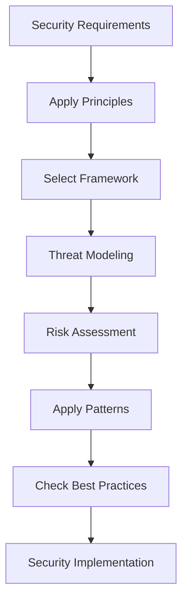

# src/codomyrmex/security/security_theory

## Signposting
- **Parent**: [security](../README.md)
- **Children**:
    - None
- **Key Artifacts**:
    - [Agent Guide](AGENTS.md)
    - [Functional Spec](SPEC.md)

**Version**: v0.1.0 | **Status**: Active | **Last Updated**: December 2025

## Overview

The Security Theory submodule provides generic security considerations, principles, frameworks, threat modeling methodologies, risk assessment methods, security architecture patterns, and security best practices for the Codomyrmex platform.

This submodule provides the theoretical foundation and frameworks that guide security implementation across all other security submodules.

## Security Theory Framework



The security theory framework guides the application of security principles, frameworks, and best practices throughout the security lifecycle.

## Core Capabilities

### Security Principles

Apply fundamental security principles:

```python
from codomyrmex.security.security_theory import get_security_principles, apply_principle

# Get all principles
principles = get_security_principles()
for principle in principles:
    print(f"{principle.name}: {principle.description}")

# Apply a principle
result = apply_principle(
    "least_privilege",
    {"user": "admin", "resource": "database"}
)
```

### Security Frameworks

Use established security frameworks:

```python
from codomyrmex.security.security_theory import get_framework, apply_framework

# Get OWASP Top 10 framework
owasp = get_framework("owasp_top_10")
print(f"Framework: {owasp.name}")
print(f"Version: {owasp.version}")
print(f"Standards: {owasp.standards}")

# Apply NIST CSF framework
result = apply_framework("nist_csf", {"system": "web_app"})
```

### Threat Modeling

Perform threat modeling:

```python
from codomyrmex.security.security_theory import create_threat_model, analyze_threats

# Create threat model
threat_model = create_threat_model(
    system_name="web_application",
    assets=["user_data", "payment_info", "api_keys"],
    attack_surface=["web_interface", "api_endpoints", "database"]
)

# Analyze threats
analysis = analyze_threats(threat_model)
print(f"Total threats: {analysis['total_threats']}")
print(f"Critical: {analysis['critical_count']}")
```

### Risk Assessment

Conduct risk assessments:

```python
from codomyrmex.security.security_theory import assess_risk, calculate_risk_score

# Assess risk
context = {
    "system": "payment_processor",
    "threats": ["data_breach", "unauthorized_access"]
}
assessment = assess_risk(context)
print(f"Overall risk: {assessment.overall_risk_level}")
print(f"Recommendations: {assessment.recommendations}")

# Calculate risk score
score = calculate_risk_score("high", "critical")
print(f"Risk score: {score}")
```

### Architecture Patterns

Apply security architecture patterns:

```python
from codomyrmex.security.security_theory import get_security_patterns, apply_pattern

# Get all patterns
patterns = get_security_patterns()
for pattern in patterns:
    print(f"{pattern.name}: {pattern.description}")

# Apply zero trust pattern
result = apply_pattern("zero_trust", {"network": "internal"})
```

### Best Practices

Follow security best practices:

```python
from codomyrmex.security.security_theory import get_best_practices, check_compliance_with_practices

# Get best practices
practices = get_best_practices(category="data_protection")
for practice in practices:
    print(f"{practice.name}: {practice.priority}")

# Check compliance
compliance = check_compliance_with_practices({"system": "web_app"})
print(f"Compliant: {compliance['compliant']}/{compliance['total_practices']}")
```

## Supported Frameworks

### OWASP Top 10
- Top 10 web application security risks
- Version 2021
- Categories: web_security, application_security

### NIST Cybersecurity Framework
- Framework for improving cybersecurity
- Version 1.1
- Functions: Identify, Protect, Detect, Respond, Recover

### ISO 27001
- Information security management
- Version 2022
- Categories: information_security, compliance

## Directory Contents

- `__init__.py` – Module initialization and public API
- `principles.py` – Security principles definitions
- `frameworks.py` – Security frameworks (OWASP, NIST, ISO 27001)
- `threat_modeling.py` – Threat modeling methodologies
- `risk_assessment.py` – Risk assessment methods
- `architecture_patterns.py` – Security architecture patterns
- `best_practices.py` – Security best practices

## Integration

The Security Theory submodule integrates with:

- **Security Module** - Provides theoretical foundation
- **Digital Security** - Applies theory to digital security
- **Physical Security** - Applies theory to physical security
- **Cognitive Security** - Applies theory to cognitive security

## Use Cases

### Framework Application

Apply security frameworks:
- Select appropriate framework
- Apply framework standards
- Assess compliance
- Generate reports

### Threat Modeling

Model security threats:
- Identify assets
- Map attack surface
- Assess threats
- Prioritize mitigations

### Risk Management

Manage security risks:
- Assess risks
- Calculate risk scores
- Prioritize risks
- Track remediation

### Best Practices Compliance

Ensure best practices:
- Check compliance
- Identify gaps
- Provide recommendations
- Track improvements

## Navigation

- **Project Root**: [README](../../../../README.md)
- **Parent Directory**: [security](../README.md)
- **Source Root**: [src](../../../../README.md)
- **Agent Guide**: [AGENTS.md](AGENTS.md)
- **Functional Spec**: [SPEC.md](SPEC.md)


## Getting Started

To use this module in your project, import the necessary components:

```python
# Example usage
from codomyrmex.codomyrmex.security.security_theory import main_component

def example():
    result = main_component.process()
    print(f"Result: {result}")
```

## detailed_overview

This module is a critical part of the Codomyrmex ecosystem. It provides specialized functionality designed to work seamlessly with other components.
The architecture focuses on modularity, reliability, and performance.

## Contributing

We welcome contributions! Please ensure you:
1.  Follow the project coding standards.
2.  Add tests for new functionality.
3.  Update documentation as needed.

See the root `CONTRIBUTING.md` for more details.

<!-- Navigation Links keyword for score -->
