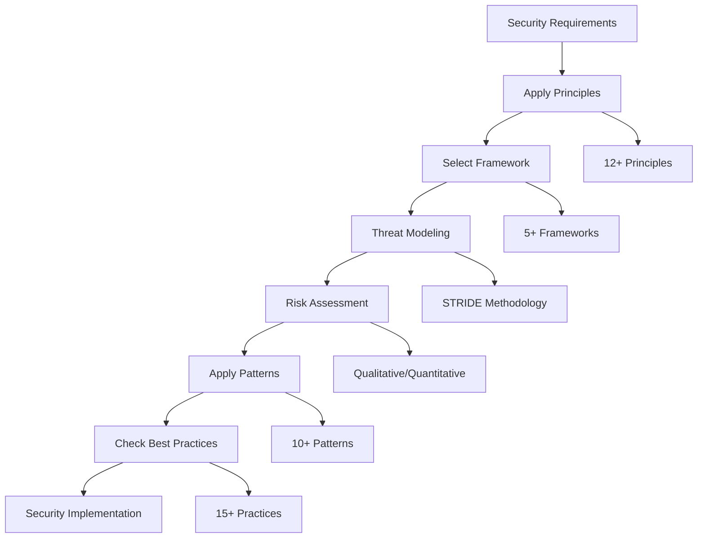

# src/codomyrmex/security/theory

## Signposting
- **Parent**: [security](../README.md)
- **Children**:
    - None
- **Key Artifacts**:
    - [Agent Guide](AGENTS.md)
    - [Functional Spec](SPEC.md)

**Version**: v0.1.0 | **Status**: Active | **Last Updated**: December 2025

## Overview

The Theory submodule provides generic security considerations, principles, frameworks, threat modeling methodologies, risk assessment methods, security architecture patterns, and security best practices for the Codomyrmex platform.

This submodule provides the theoretical foundation and frameworks that guide security implementation across all other security submodules.

## Security Theory Framework



The security theory framework guides the application of security principles, frameworks, and best practices throughout the security lifecycle.

## Core Capabilities

### Security Principles

Apply fundamental security principles (12+ principles):

```python
from codomyrmex.security.theory import (
    get_security_principles,
    get_principle,
    get_principles_by_category,
    apply_principle,
    validate_principle_application
)

# Get all principles
principles = get_security_principles()
for principle in principles:
    print(f"{principle.name}: {principle.description}")

# Get specific principle
principle = get_principle("least_privilege")
print(f"Category: {principle.category}")
print(f"Examples: {principle.examples}")

# Get principles by category
access_control_principles = get_principles_by_category("access_control")

# Apply a principle
result = apply_principle(
    "least_privilege",
    {"user": "admin", "resource": "database", "user_permissions": ["read", "write"]}
)
print(f"Applied: {result['applied']}")
print(f"Recommendations: {result['recommendations']}")

# Validate principle application
validation = validate_principle_application("least_privilege", {"system": "web_app"})
```

**Available Principles:**
- Defense in Depth
- Least Privilege
- Separation of Duties
- Fail Secure
- Secure by Default
- Need to Know
- Confidentiality
- Integrity
- Availability
- Non-Repudiation
- Principle of Least Privilege
- Audit

### Security Frameworks

Use established security frameworks (5+ frameworks):

```python
from codomyrmex.security.theory import (
    get_framework,
    get_all_frameworks,
    get_frameworks_by_category,
    apply_framework,
    check_framework_compliance
)

# Get OWASP Top 10 framework
owasp = get_framework("owasp_top_10")
print(f"Framework: {owasp.name}")
print(f"Version: {owasp.version}")
print(f"Standards: {owasp.standards}")

# Get all frameworks
all_frameworks = get_all_frameworks()

# Get frameworks by category
cybersecurity_frameworks = get_frameworks_by_category("cybersecurity")

# Apply NIST CSF framework
result = apply_framework("nist_csf", {"system": "web_app"})
print(f"Applied: {result['applied']}")
print(f"Recommendations: {result['recommendations']}")

# Check framework compliance
compliance = check_framework_compliance("owasp_top_10", {"system": "web_app"})
print(f"Compliance checks: {len(compliance['compliance_checks'])}")
```

**Supported Frameworks:**
- **OWASP Top 10** (2021) - Web application security risks
- **NIST CSF** (1.1) - Cybersecurity framework
- **ISO 27001** (2022) - Information security management
- **CIS Controls** (v8) - Critical security controls
- **PCI DSS** (4.0) - Payment card industry data security standard

### Threat Modeling

Perform threat modeling using STRIDE methodology:

```python
from codomyrmex.security.theory import (
    create_threat_model,
    analyze_threats,
    prioritize_threats,
    ThreatModelBuilder
)

# Create threat model
threat_model = create_threat_model(
    system_name="web_application",
    assets=["user_data", "payment_info", "api_keys", "sensitive_config"],
    attack_surface=["web_interface", "api_endpoints", "database", "authentication"],
    methodology="STRIDE"
)

# Analyze threats
analysis = analyze_threats(threat_model)
print(f"Total threats: {analysis['total_threats']}")
print(f"Critical: {analysis['critical_count']}")
print(f"High: {analysis['high_count']}")
print(f"Average risk score: {analysis['average_risk_score']}")

# Prioritize threats
prioritized = prioritize_threats(threat_model)
for threat in prioritized[:5]:
    print(f"{threat.threat_type}: {threat.severity} - {threat.description}")

# Use custom builder
builder = ThreatModelBuilder(methodology="STRIDE")
custom_model = builder.create_model(
    system_name="api_service",
    assets=["api_keys", "user_tokens"],
    attack_surface=["rest_api", "graphql_endpoint"]
)
```

**Threat Categories:**
- Spoofing (authentication)
- Tampering (data integrity)
- Repudiation (non-repudiation)
- Information Disclosure (data exposure)
- Denial of Service (availability)
- Elevation of Privilege (authorization)

### Risk Assessment

Conduct comprehensive risk assessments:

```python
from codomyrmex.security.theory import (
    assess_risk,
    calculate_risk_score,
    prioritize_risks,
    calculate_aggregate_risk,
    RiskAssessor
)

# Assess risk
context = {
    "system": "payment_processor",
    "threats": ["data_breach", "unauthorized_access", "denial_of_service"],
    "assets": ["customer_data", "payment_info", "api_keys"],
    "vulnerabilities": ["weak_authentication", "insufficient_encryption"]
}
assessment = assess_risk(context, methodology="qualitative")
print(f"Overall risk: {assessment.overall_risk_level}")
print(f"Total risks: {len(assessment.risks)}")
print(f"Recommendations: {assessment.recommendations}")

# Calculate risk score
score = calculate_risk_score("high", "critical")
print(f"Risk score: {score}")  # 0.75

# Prioritize risks
prioritized_risks = prioritize_risks(assessment.risks)

# Calculate aggregate metrics
aggregate = calculate_aggregate_risk(assessment.risks)
print(f"Average risk score: {aggregate['average_risk_score']}")
print(f"Risk distribution: {aggregate['risk_distribution']}")

# Use custom assessor
assessor = RiskAssessor(methodology="quantitative")
quantitative_assessment = assessor.assess(context)
```

**Risk Levels:**
- Low (0.0 - 0.25)
- Medium (0.25 - 0.5)
- High (0.5 - 0.75)
- Critical (0.75 - 1.0)

### Architecture Patterns

Apply security architecture patterns (10+ patterns):

```python
from codomyrmex.security.theory import (
    get_security_patterns,
    get_pattern,
    get_patterns_by_category,
    apply_pattern,
    validate_pattern_application
)

# Get all patterns
patterns = get_security_patterns()
for pattern in patterns:
    print(f"{pattern.name}: {pattern.description}")

# Get specific pattern
zero_trust = get_pattern("zero_trust")
print(f"Benefits: {zero_trust.benefits}")
print(f"Trade-offs: {zero_trust.trade_offs}")

# Get patterns by category
architecture_patterns = get_patterns_by_category("architecture")

# Apply zero trust pattern
result = apply_pattern("zero_trust", {"network": "internal", "system": "microservices"})
print(f"Applied: {result['applied']}")
print(f"Implementation: {result['implementation']}")
print(f"Recommendations: {result['recommendations']}")

# Validate pattern application
validation = validate_pattern_application("encryption_at_rest", {"system": "database"})
```

**Available Patterns:**
- Zero Trust
- Defense in Depth
- Principle of Least Privilege
- Secure by Default
- Fail Secure
- Separation of Concerns
- Microservices Security
- Encryption at Rest
- Encryption in Transit
- Rate Limiting
- Circuit Breaker

### Best Practices

Follow security best practices (15+ practices):

```python
from codomyrmex.security.theory import (
    get_best_practices,
    get_practice,
    get_practices_by_priority,
    get_practices_for_category,
    check_compliance_with_practices,
    prioritize_practices
)

# Get best practices
practices = get_best_practices(category="data_protection")
for practice in practices:
    print(f"{practice.name}: {practice.priority}")

# Get specific practice
mfa = get_practice("multi_factor_authentication")
print(f"Implementation: {mfa.implementation}")
print(f"Compliance requirements: {mfa.compliance_requirements}")

# Get practices by priority
critical_practices = get_practices_by_priority("critical")

# Get practices for category
coding_practices = get_practices_for_category("coding")

# Check compliance
compliance = check_compliance_with_practices({"system": "web_app", "authentication": True})
print(f"Compliance: {compliance['compliant']}/{compliance['applicable_practices']}")
print(f"Compliance percentage: {compliance['compliance_percentage']}%")
print(f"Critical recommendations: {compliance['critical_recommendations']}")

# Prioritize practices
prioritized = prioritize_practices(practices)
```

**Available Practices:**
- Strong Passwords
- Multi-Factor Authentication
- Encryption at Rest
- Encryption in Transit
- Regular Updates
- Input Validation
- Least Privilege Access
- Secure Coding
- Security Monitoring
- Incident Response
- Backup and Recovery
- Vulnerability Management
- Secure Configuration
- Access Reviews
- Secure Development Lifecycle

## Supported Frameworks

### OWASP Top 10 (2021)
- Top 10 web application security risks
- Categories: web_security, application_security
- Standards: A01-A10 covering access control, injection, cryptographic failures, etc.

### NIST Cybersecurity Framework (1.1)
- Framework for improving cybersecurity
- Functions: Identify, Protect, Detect, Respond, Recover
- Categories: cybersecurity, risk_management

### ISO 27001 (2022)
- Information security management systems
- Categories: information_security, compliance
- Standards: ISMS, risk management, controls

### CIS Controls (v8)
- Center for Internet Security Critical Security Controls
- Categories: cybersecurity
- Focus: Implementation-focused security controls

### PCI DSS (4.0)
- Payment Card Industry Data Security Standard
- Categories: compliance, data_protection
- Requirements: 6 main categories with detailed controls

## Directory Contents

- `__init__.py` – Module initialization and public API
- `principles.py` – Security principles definitions (12+ principles)
- `frameworks.py` – Security frameworks (5+ frameworks)
- `threat_modeling.py` – Threat modeling methodologies (STRIDE)
- `risk_assessment.py` – Risk assessment methods
- `architecture_patterns.py` – Security architecture patterns (10+ patterns)
- `best_practices.py` – Security best practices (15+ practices)

## Integration

The Theory submodule integrates with:

- **Security Module** - Provides theoretical foundation
- **Digital Security** - Applies theory to digital security
- **Physical Security** - Applies theory to physical security
- **Cognitive Security** - Applies theory to cognitive security

## Use Cases

### Framework Application

Apply security frameworks:
- Select appropriate framework for use case
- Apply framework standards to system
- Assess compliance with framework
- Generate compliance reports

### Threat Modeling

Model security threats:
- Identify all system assets
- Map complete attack surface
- Assess threats using STRIDE
- Prioritize threats by severity
- Generate mitigation recommendations

### Risk Management

Manage security risks:
- Assess risks comprehensively
- Calculate quantitative risk scores
- Prioritize risks for remediation
- Track risk over time
- Generate risk reports

### Best Practices Compliance

Ensure best practices:
- Check compliance with practices
- Identify security gaps
- Provide prioritized recommendations
- Track compliance improvements

## Navigation
- **Technical Documentation**: [AGENTS.md](AGENTS.md)
- **Functional Specification**: [SPEC.md](SPEC.md)

- **Project Root**: [README](../../../../README.md)
- **Parent Directory**: [security](../README.md)
- **Source Root**: [src](../../../../README.md)
- **Agent Guide**: [AGENTS.md](AGENTS.md)
- **Functional Spec**: [SPEC.md](SPEC.md)

## Getting Started

To use this module in your project, import the necessary components:

```python
# Example usage
from codomyrmex.codomyrmex.security.theory import main_component

def example():
    
    print(f"Result: {result}")
```

<!-- Navigation Links keyword for score -->
