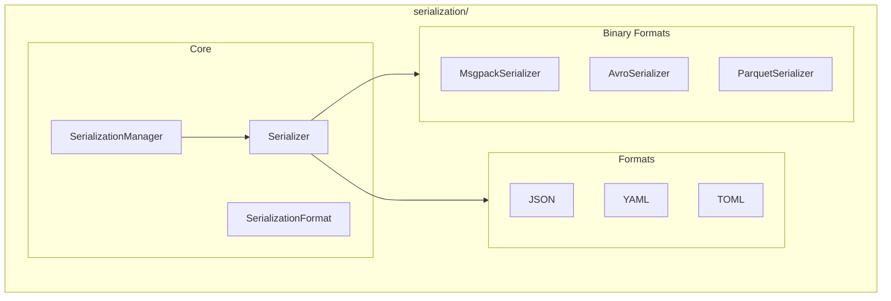

# Serialization Module

**Version**: v0.1.0 | **Status**: Active | **Last Updated**: January 2026

## Overview

The Serialization module provides unified data serialization and deserialization with support for multiple formats including JSON, YAML, TOML, MessagePack, Avro, and Parquet.

## Architecture



## Key Classes

| Class | Purpose |
|-------|---------|
| `Serializer` | Core serialization/deserialization |
| `SerializationManager` | Format registry and configuration |
| `SerializationFormat` | Enum of supported formats |
| `MsgpackSerializer` | MessagePack binary format |
| `AvroSerializer` | Apache Avro serialization |
| `ParquetSerializer` | Apache Parquet columnar format |

## Exceptions

| Exception | When Raised |
|-----------|-------------|
| `SerializationError` | General serialization failure |
| `DeserializationError` | Deserialization failure |
| `SchemaValidationError` | Data doesn't match schema |
| `EncodingError` | Character encoding issues |
| `FormatNotSupportedError` | Unknown format requested |
| `CircularReferenceError` | Circular reference detected |
| `TypeConversionError` | Type conversion failure |
| `BinaryFormatError` | Binary format specific error |

## Quick Start

### Basic Serialization

```python
from codomyrmex.serialization import serialize, deserialize

data = {"name": "example", "values": [1, 2, 3]}

# Serialize to JSON (default)
json_bytes = serialize(data)

# Deserialize back
restored = deserialize(json_bytes)
```

### Different Formats

```python
from codomyrmex.serialization import serialize, deserialize

data = {"config": {"debug": True}}

# YAML format
yaml_bytes = serialize(data, format="yaml")
config = deserialize(yaml_bytes, format="yaml")

# MessagePack (compact binary)
msgpack_bytes = serialize(data, format="msgpack")
config = deserialize(msgpack_bytes, format="msgpack")
```

### Binary Serializers

```python
from codomyrmex.serialization import MsgpackSerializer, AvroSerializer

# MessagePack for efficient binary serialization
msgpack = MsgpackSerializer()
packed = msgpack.serialize({"key": "value"})
unpacked = msgpack.deserialize(packed)

# Avro with schema validation
avro = AvroSerializer(schema=my_schema)
avro_bytes = avro.serialize(record)
```

## Supported Formats

| Format | Extension | Use Case |
|--------|-----------|----------|
| JSON | `.json` | Human-readable, web APIs |
| YAML | `.yaml` | Configuration files |
| TOML | `.toml` | Configuration files |
| MessagePack | `.msgpack` | Efficient binary serialization |
| Avro | `.avro` | Schema-enforced data |
| Parquet | `.parquet` | Columnar analytics data |

## Integration Points

- **cache**: Serialize cached values
- **config_management**: Config file parsing
- **database_management**: Data storage formats
- **networking**: API request/response handling

## Navigation

- **Parent**: [../README.md](../README.md)
- **Siblings**: [cache](../cache/), [config_management](../config_management/)
- **Spec**: [SPEC.md](SPEC.md)
