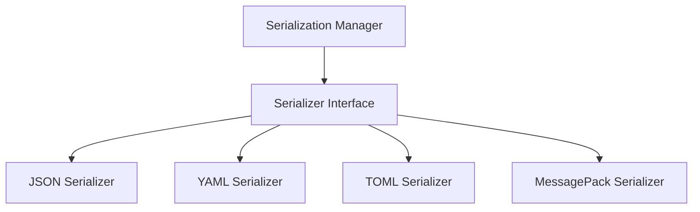

# serialization - Functional Specification

**Version**: v0.1.0 | **Status**: Proposed | **Last Updated**: December 2025

## Purpose

Serialization module providing unified data serialization/deserialization with support for JSON, YAML, TOML, MessagePack, and other formats. Integrates with `documents` and `config_management` modules.

## Design Principles

### Modularity
- Format-agnostic serialization interface
- Support for multiple serialization formats
- Pluggable serializer system

### Internal Coherence
- Unified serialization error handling
- Consistent encoding/decoding patterns
- Integration with document handling

### Parsimony
- Essential serialization operations
- Minimal dependencies
- Focus on common formats

### Functionality
- Working implementations for common formats
- Support for custom serializers
- Type preservation where possible

### Testing
- Unit tests for all formats
- Integration tests with real data
- Encoding/decoding round-trip tests

### Documentation
- Complete API specifications
- Usage examples for each format
- Format-specific documentation

## Architecture



## Functional Requirements

### Core Operations
1. **Serialize**: Convert objects to string/bytes
2. **Deserialize**: Convert string/bytes to objects
3. **Format Detection**: Auto-detect serialization format
4. **Type Preservation**: Preserve types where possible
5. **Custom Serializers**: Register custom serialization logic

### Integration Points
- `documents/` - Document serialization
- `config_management/` - Configuration serialization
- `cache/` - Cache value serialization

## Quality Standards

### Code Quality
- Type hints for all functions
- PEP 8 compliance
- Comprehensive error handling

### Testing Standards
- ≥80% coverage
- Format-specific tests
- Round-trip serialization tests

### Documentation Standards
- README.md, AGENTS.md, SPEC.md
- API_SPECIFICATION.md
- USAGE_EXAMPLES.md

## Interface Contracts

### Serializer Interface
```python
class Serializer:
    def serialize(obj: Any) -> str | bytes
    def deserialize(data: str | bytes) -> Any
    def detect_format(data: str | bytes) -> Optional[str]
```

## Implementation Guidelines

### Serializer Implementation
1. Implement Serializer interface for each format
2. Handle encoding/decoding errors
3. Support type hints
4. Provide format detection

### Integration
1. Integrate with documents module
2. Add serialization to config_management
3. Support cache serialization

## Navigation

- **Parent**: [codomyrmex](../AGENTS.md)
- **Related**: [documents](../documents/AGENTS.md), [config_management](../config_management/AGENTS.md)

