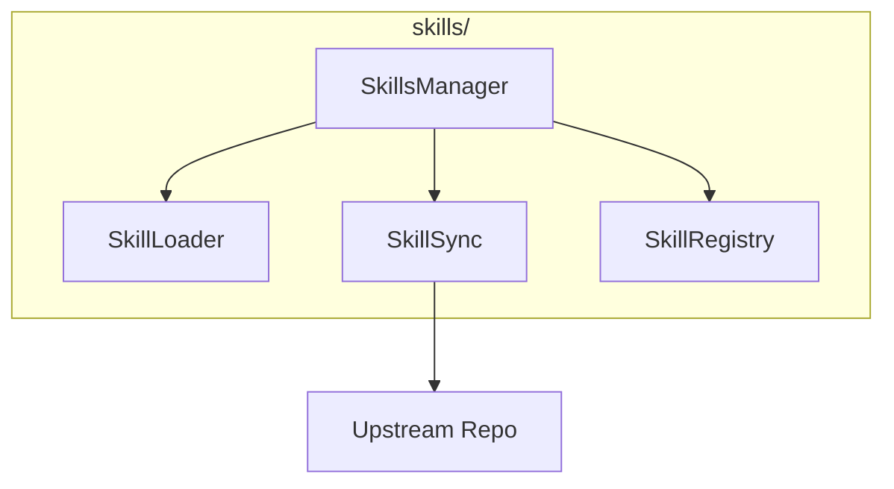

# Skills Module

**Version**: v0.1.0 | **Status**: Active | **Last Updated**: January 2026

## Overview

The Skills module provides integration with skill repositories (e.g., vibeship-spawner-skills), enabling skill management, syncing with upstream, and support for custom skills in the Codomyrmex platform.

## Architecture



## Key Classes

| Class | Purpose |
|-------|---------|
| `SkillsManager` | Main skill orchestrator |
| `SkillLoader` | Load skill definitions |
| `SkillSync` | Sync with upstream |
| `SkillRegistry` | Register and lookup skills |

## Quick Start

### Get Skills Manager

```python
from codomyrmex.skills import get_skills_manager

manager = get_skills_manager(auto_sync=True)
```

### List Skills

```python
from codomyrmex.skills import SkillsManager

manager = SkillsManager()

for skill in manager.list_skills():
    print(f"{skill.name}: {skill.description}")
```

### Load Skill

```python
from codomyrmex.skills import SkillLoader

loader = SkillLoader()
skill = loader.load("code-review")

# Use skill
result = skill.execute(context=my_context)
```

### Sync with Upstream

```python
from codomyrmex.skills import SkillSync

sync = SkillSync(
    upstream_repo="https://github.com/vibeforge1111/vibeship-spawner-skills",
    upstream_branch="main"
)

# Sync latest skills
sync.sync()
```

### Custom Registry

```python
from codomyrmex.skills import SkillRegistry

registry = SkillRegistry()

# Register custom skill
registry.register(my_custom_skill)

# Lookup skill
skill = registry.get("my-skill-name")
```

## Configuration

```python
from codomyrmex.skills import get_skills_manager
from pathlib import Path

manager = get_skills_manager(
    skills_dir=Path("./my-skills"),
    upstream_repo="https://github.com/org/skills",
    upstream_branch="main",
    auto_sync=True
)
```

## Integration Points

- **agents**: Agent skill execution
- **cli**: CLI skills commands
- **ide**: IDE skill integration

## Navigation

- **Parent**: [../README.md](../README.md)
- **Siblings**: [agents](../agents/), [cli](../cli/)
- **Spec**: [SPEC.md](SPEC.md)
