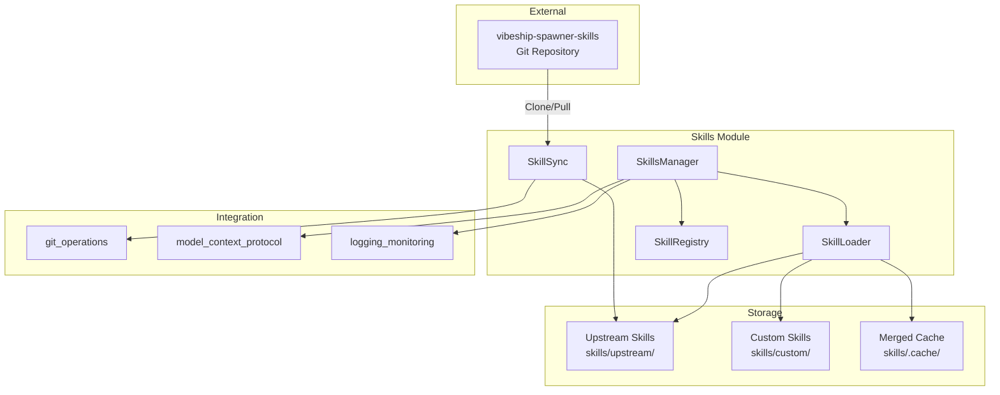

# skills - Functional Specification

**Version**: v0.1.0 | **Status**: Active | **Last Updated**: January 2026

## Purpose

Integration with the [vibeship-spawner-skills](https://github.com/vibeforge1111/vibeship-spawner-skills) repository, providing access to 462+ specialized skills organized across 35 categories. Enables skill management, syncing with upstream, and support for custom skills that can override upstream skills.

## Design Principles

### Modularity

- Self-contained module with clear boundaries
- Minimal dependencies on other codomyrmex modules
- Composable functionality

### Integration

- Seamless integration with upstream repository
- Support for custom skills that override upstream
- Merge logic: custom takes precedence

### Performance

- Optional caching for improved performance
- Lazy loading of skills
- Efficient indexing and search

## Architecture



## Functional Requirements

### Core Operations

1. **Initialization**
   - Setup skills directory structure
   - Clone upstream repository if not present
   - Build skill index
   - Support auto-sync on initialization

2. **Upstream Sync**
   - Clone upstream repository
   - Pull latest changes
   - Check upstream status
   - Get upstream version/commit

3. **Skill Loading**
   - Load skills from YAML files
   - Merge custom skills with upstream (custom overrides)
   - Cache merged skills for performance
   - Support both directory-based and file-based skill structures

4. **Skill Discovery**
   - Index all available skills
   - Categorize skills by category
   - Search skills by query/pattern
   - Get skill metadata

5. **Custom Skills**
   - Add custom skills
   - Custom skills override upstream with same name
   - Store custom skills in separate directory
   - Refresh index after adding custom skills

### Integration Points

1. **Git Operations**
   - Use `codomyrmex.git_operations` for cloning/pulling
   - Store upstream clone in `skills/upstream/`

2. **MCP Tools**
   - `skills_list` - List available skills
   - `skills_get` - Get specific skill content
   - `skills_search` - Search skills
   - `skills_sync` - Sync with upstream
   - `skills_add_custom` - Add custom skill

3. **CLI Commands**
   - `codomyrmex skills sync` - Manual sync with upstream
   - `codomyrmex skills list [category]` - List skills
   - `codomyrmex skills get <category> <name>` - Get skill content
   - `codomyrmex skills search <query>` - Search skills

## Directory Structure

```
src/codomyrmex/skills/
├── skills/
│   ├── upstream/          # Cloned vibeship-spawner-skills content
│   │   ├── ai-agents/
│   │   ├── backend/
│   │   └── ... (35 categories)
│   ├── custom/             # User-defined custom skills
│   │   └── [category]/
│   └── .cache/             # Merged/cached skills
├── __init__.py
├── skills_manager.py
├── skill_loader.py
├── skill_sync.py
├── skill_registry.py
├── skill_validator.py
├── AGENTS.md
├── README.md
├── SPEC.md
├── tests/
└── docs/
```

## Custom Skills Override Logic

When loading a skill:
1. Check `skills/custom/[category]/[name]/skill.yaml` first
2. If exists, use it (overrides upstream)
3. If not, use `skills/upstream/[category]/[name]/skill.yaml`
4. Cache merged result in `.cache/` for performance

## Configuration

- `skills.upstream_repo_url` - Repository URL (default: https://github.com/vibeforge1111/vibeship-spawner-skills)
- `skills.upstream_branch` - Branch to track (default: main)
- `skills.auto_sync` - Auto-sync on initialization (default: false)
- `skills.cache_enabled` - Enable skill caching (default: true)
- `skills.custom_dir` - Custom skills directory (default: skills/custom/)

## Testing Strategy

- Unit tests for each component
- Integration tests for git sync operations
- Test skill loading and merging logic
- Test MCP tool integration
- Mock git operations for isolated testing
- Test custom skill override behavior

## Success Criteria

1. Module follows standard codomyrmex structure
2. Can clone and sync vibeship-spawner-skills repository
3. Skills load correctly from YAML files
4. Custom skills override upstream skills
5. MCP tools functional
6. CLI commands work
7. Tests pass with ≥80% coverage
8. Documentation complete and accurate

## Navigation

- **Human Documentation**: [README.md](README.md)
- **Technical Documentation**: [AGENTS.md](AGENTS.md)
- **Parent Directory**: [codomyrmex](../README.md)
- **Project Root**: [README](../../../README.md)

<!-- Navigation Links keyword for score -->
