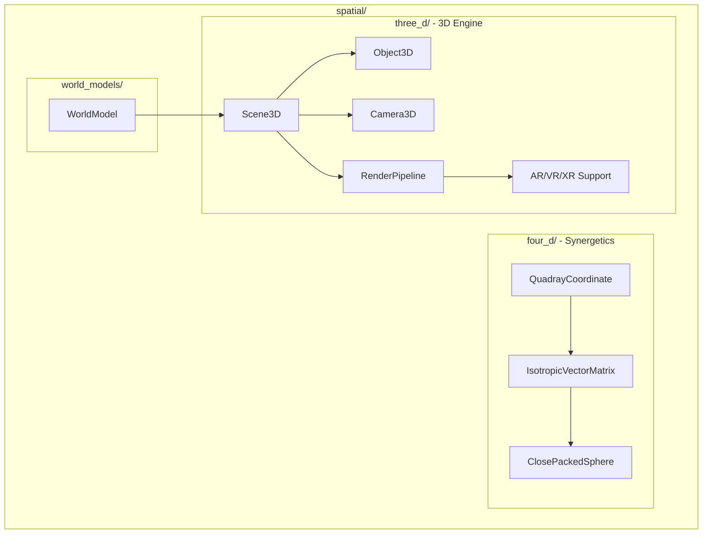

# Spatial Module

**Version**: v0.1.0 | **Status**: Active | **Last Updated**: January 2026

## Overview

The Spatial module provides 3D modeling, 4D (Synergetics) mathematics, and world modeling capabilities for the Codomyrmex platform. It enables spatial computing, AR/VR/XR support, and agent environment modeling.

## Architecture



## Submodules

### three_d - 3D Engine

Full 3D modeling and rendering with AR/VR/XR support.

| Class | Purpose |
|-------|---------|
| `Scene3D` | 3D scene container |
| `Object3D` | Base 3D object |
| `Camera3D` | Viewpoint/camera |
| `Light3D` | Scene lighting |
| `Material3D` | Surface materials |
| `RenderPipeline` | Rendering orchestration |
| `ARSession` | Augmented reality session |
| `VRRenderer` | Virtual reality rendering |
| `XRInterface` | Extended reality interface |
| `MeshLoader` | 3D mesh file import |
| `PhysicsEngine` | Physics simulation |

### four_d - Synergetics (Buckminster Fuller)

4D coordinate systems based on R. Buckminster Fuller's Synergetics.

| Class | Purpose |
|-------|---------|
| `QuadrayCoordinate` | 4-vector coordinate system (a,b,c,d) |
| `IsotropicVectorMatrix` | IVM lattice structure |
| `ClosePackedSphere` | Sphere packing geometry |

**Functions:**

- `synergetics_transform(coord_3d)` - Transform 3D to 4D Synergetic coordinates

### world_models - Agent Environments

World modeling for AI agents.

| Class | Purpose |
|-------|---------|
| `WorldModel` | Agent environment representation |

## Quick Start

### 3D Scene Creation

```python
from codomyrmex.spatial.three_d import Scene3D, Object3D, Camera3D

# Create a scene
scene = Scene3D()

# Add objects
cube = Object3D(geometry="cube", position=(0, 0, 0))
scene.add(cube)

# Set up camera
camera = Camera3D(position=(5, 5, 5), target=(0, 0, 0))
scene.set_camera(camera)

# Render
scene.render()
```

### Synergetics Coordinates

```python
from codomyrmex.spatial.four_d import QuadrayCoordinate, synergetics_transform

# Create a Quadray coordinate
q = QuadrayCoordinate(a=1, b=0, c=0, d=0)
print(q.coords)  # (1, 0, 0, 0)

# Transform 3D to 4D
coord_4d = synergetics_transform((1.0, 2.0, 3.0))
```

### World Modeling

```python
from codomyrmex.spatial.world_models import WorldModel

# Create agent world model
world = WorldModel(environment_type="indoor")
world.update(perception_data={"objects": [...], "walls": [...]})
```

## Directory Structure

```
spatial/
├── __init__.py          # Submodule exports
├── three_d/             # 3D engine
│   ├── engine_3d.py     # Core 3D classes
│   ├── rendering_pipeline.py
│   ├── ar_vr_support.py
│   └── examples/
├── four_d/              # Synergetics
│   └── __init__.py      # Quadray, IVM, CPS
└── world_models/        # Agent environments
    └── __init__.py      # WorldModel
```

## Integration Points

- **data_visualization**: 3D visualizations
- **agents**: World models for agent perception
- **cerebrum**: Spatial reasoning

## Navigation

- **Parent**: [../README.md](../README.md)
- **Siblings**: [data_visualization](../data_visualization/), [agents](../agents/)
- **Spec**: [SPEC.md](SPEC.md)
