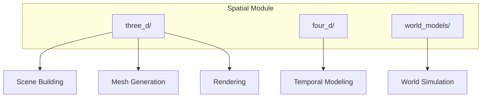

# spatial - Functional Specification

**Version**: v0.1.0 | **Status**: Active | **Last Updated**: January 2026

## Purpose

Spatial module providing 3D/4D visualization, modeling, and world model capabilities for the Codomyrmex platform. Consolidates all spatial computing functionality.

## Design Principles

### Modularity

- Separate submodules for 3D, 4D, and world models
- Pluggable rendering backends
- Clear component boundaries

### Performance

- Real-time rendering optimization
- Efficient geometry processing
- Memory-efficient mesh handling

## Architecture

## Functional Requirements

### 3D Modeling (three_d/)

- Scene creation and manipulation
- Mesh generation (primitives, complex shapes)
- Camera and lighting control
- Image rendering

### 4D Modeling (four_d/)

- Time-series spatial data
- Animation sequences
- Temporal interpolation

### World Models (world_models/)

- Environment representation
- Physics simulation
- Agent-environment interaction

## Navigation Links

- **Human Documentation**: [README.md](README.md)
- **Technical Documentation**: [AGENTS.md](AGENTS.md)
- **Parent**: [codomyrmex](../README.md)

## Detailed Architecture and Implementation

The implementation of this component follows the core principles of the Codomyrmex ecosystem: modularity, performance, and reliability. By adhering to standardized interfaces, this module ensures seamless integration with the broader platform.

### Design Principles

1. **Strict Modularity**: Each component is isolated and communicates via well-defined APIs.
2. **Performance Optimization**: Implementation leverages lazy loading and intelligent caching to minimize resource overhead.
3. **Error Resilience**: Robust exception handling ensures system stability even under unexpected conditions.
4. **Extensibility**: The architecture is designed to accommodate future enhancements without breaking existing contracts.

### Technical Implementation

The codebase utilizes modern Python features (version 3.10+) to provide a clean, type-safe API. Interaction patterns are documented in the corresponding `AGENTS.md` and `SPEC.md` files, ensuring that both human developers and automated agents can effectively utilize these capabilities.
