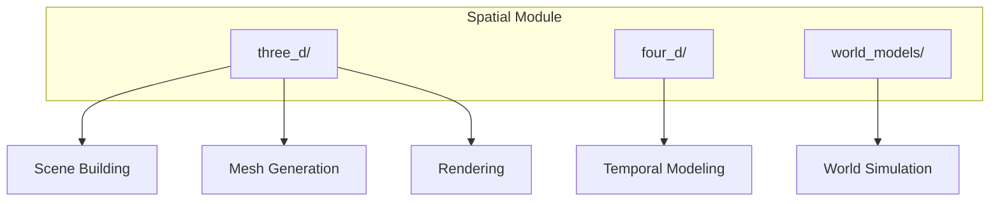

# spatial - Functional Specification

**Version**: v1.0.0 | **Status**: Active | **Last Updated**: February 2026

## Purpose

Spatial module providing 3D/4D visualization, modeling, and world model capabilities for the Codomyrmex platform. Consolidates all spatial computing functionality.

## Design Principles

### Modularity

- Separate submodules for 3D, 4D, and world models
- Pluggable rendering backends
- Clear component boundaries

### Performance

- Real-time rendering optimization
- Efficient geometry processing
- Memory-efficient mesh handling

## Architecture


```mermaid
graph TD
    subgraph "Spatial Module"
        ThreeD[three_d/]
        FourD[four_d/]
        WorldModels[world_models/]
    end

    ThreeD --> Scene[Scene Building]
    ThreeD --> Mesh[Mesh Generation]
    ThreeD --> Render[Rendering]
    
    FourD --> Temporal[Temporal Modeling]
    WorldModels --> Simulation[World Simulation]
```

## Functional Requirements

### 3D Modeling (three_d/)

- Scene creation and manipulation
- Mesh generation (primitives, complex shapes)
- Camera and lighting control
- Image rendering

### 4D Modeling (four_d/)

- Time-series spatial data
- Animation sequences
- Temporal interpolation

### World Models (world_models/)

- Environment representation
- Physics simulation
- Agent-environment interaction

### Coordinates (coordinates/) — v1.3.0

#### Geodesic Mesh Generation (`geodesic.py`)

- `IcosahedralMesh` — Dataclass holding vertices (`list[Point3D]`), faces (`list[tuple[int,int,int]]`), and subdivision frequency
- `generate_icosahedron(radius)` — Golden-ratio construction of a base icosahedron (12 vertices, 20 faces)
- `subdivide_mesh(mesh, frequency, radius)` — Recursive edge-midpoint subdivision projected onto sphere surface
- `geodesic_distance(p1, p2, radius)` — Great-circle arc length via `acos(dot(normalize(p1), normalize(p2))) * radius`

#### Quaternion Rotations (`quaternion.py`)

- `Quaternion(w, x, y, z)` — Immutable frozen dataclass for unit quaternions
- Construction: `identity()`, `from_axis_angle(axis, angle)`, `from_euler(roll, pitch, yaw)` (ZYX convention)
- Operations: `normalize()`, `conjugate()`, `inverse()`, Hamilton product (`__mul__`), `dot()`
- Application: `rotate_point(Point3D)` — Implements `p' = q * p * q⁻¹`
- Interpolation: `slerp(other, t)` — Spherical linear interpolation with shortest-path guarantee
- Conversion: `to_axis_angle()`, `to_rotation_matrix()` → `Matrix4x4`, `to_tuple()`, `to_dict()`

## Navigation Links

- **Human Documentation**: [README.md](README.md)
- **Technical Documentation**: [AGENTS.md](AGENTS.md)
- **Parent**: [codomyrmex](../README.md)

## Detailed Architecture and Implementation

### Design Principles

1. **Strict Modularity**: Each component is isolated and communicates via well-defined APIs.
2. **Performance Optimization**: Implementation leverages lazy loading and intelligent caching to minimize resource overhead.
3. **Error Resilience**: Robust exception handling ensures system stability even under unexpected conditions.
4. **Extensibility**: The architecture is designed to accommodate future enhancements without breaking existing contracts.

### Technical Implementation

The codebase utilizes modern Python features (version 3.10+) to provide a clean, type-safe API. Interaction patterns are documented in the corresponding `AGENTS.md` and `SPEC.md` files, ensuring that both human developers and automated agents can effectively utilize these capabilities.

## Testing

```bash
uv run python -m pytest src/codomyrmex/tests/ -k spatial -v
```
