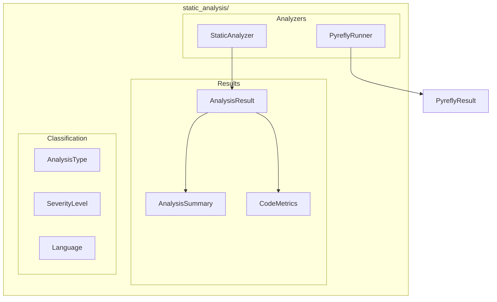

# Static Analysis Module

**Version**: v0.1.0 | **Status**: Active | **Last Updated**: January 2026

## Overview

The Static Analysis module provides tools for analyzing source code without executing it. It integrates multiple analysis tools including Pyrefly, linters, and custom analyzers to detect code quality issues, security vulnerabilities, and performance problems across multiple programming languages.

## Architecture



## Key Classes

| Class | Purpose |
|-------|---------|
| `StaticAnalyzer` | Main analyzer orchestrator |
| `PyreflyRunner` | Pyrefly integration |
| `AnalysisResult` | Individual analysis finding |
| `AnalysisSummary` | Aggregated analysis results |
| `CodeMetrics` | Code quality metrics (complexity, etc.) |

## Enums

| Enum | Values |
|------|--------|
| `AnalysisType` | `quality`, `security`, `performance`, `style` |
| `SeverityLevel` | `info`, `warning`, `error`, `critical` |
| `Language` | `python`, `javascript`, `typescript`, `go`, etc. |

## Quick Start

### Analyze a Single File

```python
from codomyrmex.static_analysis import analyze_file

result = analyze_file("src/mymodule.py")

for issue in result.issues:
    print(f"[{issue.severity}] {issue.message} at line {issue.line}")
```

### Analyze Entire Project

```python
from codomyrmex.static_analysis import analyze_project

summary = analyze_project("src/")

print(f"Total issues: {summary.total_issues}")
print(f"Errors: {summary.error_count}")
print(f"Warnings: {summary.warning_count}")

for file_result in summary.results:
    print(f"{file_result.path}: {len(file_result.issues)} issues")
```

### Pyrefly Integration

```python
from codomyrmex.static_analysis import run_pyrefly, check_pyrefly_available

if check_pyrefly_available():
    result = run_pyrefly("src/")
    
    for issue in result.issues:
        print(f"{issue.file}:{issue.line} - {issue.message}")
```

### Get Code Metrics

```python
from codomyrmex.static_analysis import StaticAnalyzer

analyzer = StaticAnalyzer()
metrics = analyzer.get_metrics("src/complex_module.py")

print(f"Cyclomatic complexity: {metrics.cyclomatic_complexity}")
print(f"Lines of code: {metrics.loc}")
print(f"Maintainability index: {metrics.maintainability}")
```

### Filter by Analysis Type

```python
from codomyrmex.static_analysis import analyze_project, AnalysisType

# Security-focused analysis
summary = analyze_project("src/", analysis_types=[AnalysisType.security])

# Only high severity
critical_issues = [
    issue for issue in summary.all_issues
    if issue.severity in ["error", "critical"]
]
```

## Available Tools

```python
from codomyrmex.static_analysis import get_available_tools

tools = get_available_tools()
# ['pyrefly', 'pylint', 'flake8', 'bandit', 'mypy', ...]
```

## Integration Points

- **logging_monitoring**: All analysis logs via centralized logging
- **environment_setup**: Tool availability verification
- **coding**: Integration with code review workflows
- **ci_cd_automation**: Pre-commit and CI checks

## Navigation

- **Parent**: [../README.md](../README.md)
- **Siblings**: [coding](../coding/), [pattern_matching](../pattern_matching/)
- **Spec**: [SPEC.md](SPEC.md)
