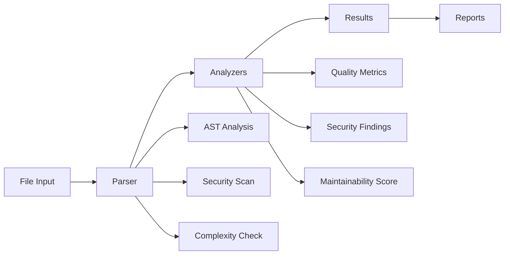

# src/codomyrmex/static_analysis

## Signposting
- **Parent**: [codomyrmex](../README.md)
- **Children**:
    - [docs](docs/README.md)
    - [tests](tests/README.md)
- **Key Artifacts**:
    - [Agent Guide](AGENTS.md)
    - [Functional Spec](SPEC.md)

**Version**: v0.1.0 | **Status**: Active | **Last Updated**: December 2025

## Overview

Core module providing static code analysis capabilities for the Codomyrmex platform. This module performs automated code quality assessment, security scanning, and complexity analysis across multiple programming languages without executing the code.

The static_analysis module serves as the foundation for code quality assurance, enabling early detection of issues and enforcement of coding standards.

## Analysis Pipeline



The static analysis pipeline processes source code through multiple stages: parsing, analysis, result aggregation, and reporting. Each analyzer focuses on specific aspects of code quality including syntax validation, security vulnerabilities, and maintainability metrics.

## Directory Contents
- `.gitignore` – File
- `API_SPECIFICATION.md` – File
- `CHANGELOG.md` – File
- `MCP_TOOL_SPECIFICATION.md` – File
- `SECURITY.md` – File
- `USAGE_EXAMPLES.md` – File
- `__init__.py` – File
- `docs/` – Subdirectory
- `pyrefly_runner.py` – File
- `requirements.txt` – File
- `static_analyzer.py` – File
- `tests/` – Subdirectory

## Navigation
- **Project Root**: [README](../../../README.md)
- **Parent Directory**: [codomyrmex](../README.md)
- **Src Hub**: [src](../../../src/README.md)

## Getting Started

To use this module in your project, import the necessary components:

```python
# Example usage
from codomyrmex.codomyrmex.static_analysis import main_component

def example():
    result = main_component.process()
    print(f"Result: {result}")
```

## detailed_overview

This module is a critical part of the Codomyrmex ecosystem. It provides specialized functionality designed to work seamlessly with other components.
The architecture focuses on modularity, reliability, and performance.

## Contributing

We welcome contributions! Please ensure you:
1.  Follow the project coding standards.
2.  Add tests for new functionality.
3.  Update documentation as needed.

See the root `CONTRIBUTING.md` for more details.

<!-- Navigation Links keyword for score -->
