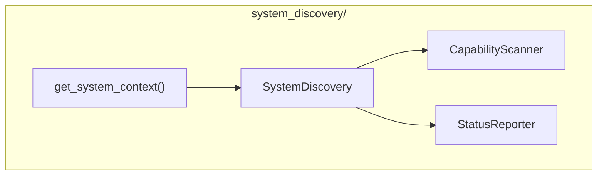

# System Discovery Module

**Version**: v0.1.0 | **Status**: Active | **Last Updated**: January 2026

## Overview

The System Discovery module provides system discovery and orchestration capabilities for the Codomyrmex ecosystem. It scans all modules, discovers capabilities, reports on system status, and provides interactive exploration tools.

## Architecture



## Key Classes

| Class | Purpose |
|-------|---------|
| `SystemDiscovery` | Main discovery engine |
| `CapabilityScanner` | Scan module capabilities |
| `StatusReporter` | Report system status |

## Functions

| Function | Purpose |
|----------|---------|
| `get_system_context()` | Get current system context |

## Quick Start

### System Discovery

```python
from codomyrmex.system_discovery import SystemDiscovery

discovery = SystemDiscovery()

# Discover all modules
modules = discovery.discover_modules()
for module in modules:
    print(f"{module.name}: {module.status}")
```

### Capability Scanning

```python
from codomyrmex.system_discovery import CapabilityScanner

scanner = CapabilityScanner()

# Scan specific module
capabilities = scanner.scan("codomyrmex.agents")

for cap in capabilities:
    print(f"Capability: {cap.name}")
    print(f"  Functions: {cap.functions}")
    print(f"  Classes: {cap.classes}")
```

### Status Reporting

```python
from codomyrmex.system_discovery import StatusReporter

reporter = StatusReporter()

# Generate status report
report = reporter.generate_report()
print(report.summary)

# Check specific module
status = reporter.check_module("agents")
print(f"Status: {status}")
```

### System Context

```python
from codomyrmex.system_discovery import get_system_context

context = get_system_context()

print(f"Available modules: {context.modules}")
print(f"System health: {context.health}")
print(f"Python version: {context.python_version}")
```

## Integration Points

- **cli**: System status commands
- **logging_monitoring**: Discovery logging
- **All modules**: Scanned for capabilities

## Navigation

- **Parent**: [../README.md](../README.md)
- **Siblings**: [cli](../cli/), [logging_monitoring](../logging_monitoring/)
- **Spec**: [SPEC.md](SPEC.md)
