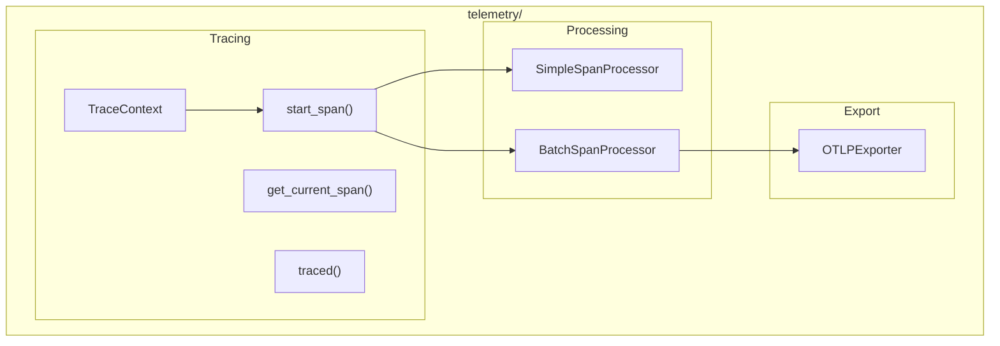

# Telemetry Module

**Version**: v0.1.0 | **Status**: Active | **Last Updated**: January 2026

## Overview

The Telemetry module provides OpenTelemetry-compatible tracing and observability tools for the Codomyrmex platform. It enables distributed tracing, span management, and OTLP export.

## Architecture



## Key Classes

| Class | Purpose |
|-------|---------|
| `TraceContext` | Trace context management |
| `SimpleSpanProcessor` | Synchronous span processing |
| `BatchSpanProcessor` | Batched span processing |
| `OTLPExporter` | Export to OTLP endpoint |

## Functions

| Function | Purpose |
|----------|---------|
| `start_span()` | Start a new span |
| `get_current_span()` | Get active span |
| `traced()` | Decorator for tracing |
| `link_span()` | Link spans together |

## Quick Start

### Basic Tracing

```python
from codomyrmex.telemetry import start_span, get_current_span

with start_span("my_operation") as span:
    span.set_attribute("user_id", "123")
    
    # Nested span
    with start_span("sub_operation") as child:
        child.set_attribute("step", 1)
        do_work()
```

### Decorator-Based Tracing

```python
from codomyrmex.telemetry import traced

@traced("process_request")
def process_request(request):
    # Automatically traced
    return handle(request)

@traced("database_query", attributes={"db": "postgres"})
def query_database(sql):
    return execute(sql)
```

### Span Linking

```python
from codomyrmex.telemetry import start_span, link_span

# Create related spans
with start_span("producer") as producer_span:
    message_id = produce_message()

# Link consumer to producer
with start_span("consumer") as consumer_span:
    link_span(consumer_span, producer_span)
    consume_message(message_id)
```

### OTLP Export

```python
from codomyrmex.telemetry import (
    OTLPExporter,
    BatchSpanProcessor,
    TraceContext
)

# Configure export
exporter = OTLPExporter(endpoint="http://localhost:4317")
processor = BatchSpanProcessor(exporter)

context = TraceContext()
context.add_processor(processor)
```

### Trace Context

```python
from codomyrmex.telemetry import TraceContext

ctx = TraceContext()

# Propagate across services
headers = ctx.extract_headers()
# ... send headers in HTTP request ...

# On receiving service
ctx.inject_headers(incoming_headers)
```

## Integration Points

- **logging_monitoring**: Correlate logs with traces
- **metrics**: Trace-to-metrics correlation
- **networking**: HTTP trace propagation

## Navigation

- **Parent**: [../README.md](../README.md)
- **Siblings**: [logging_monitoring](../logging_monitoring/), [metrics](../metrics/)
- **Spec**: [SPEC.md](SPEC.md)
