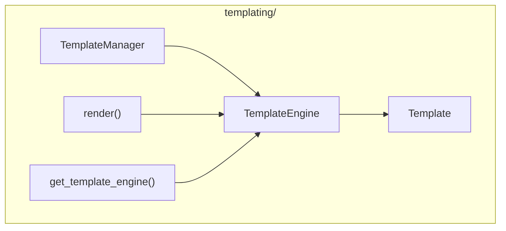

# Templating Module

**Version**: v0.1.0 | **Status**: Active | **Last Updated**: January 2026

## Overview

The Templating module provides template engine support for code generation, documentation templates, and dynamic content rendering. It supports multiple engines including Jinja2 and Mako.

## Architecture



## Key Classes

| Class | Purpose |
|-------|---------|
| `TemplateEngine` | Core template rendering engine |
| `TemplateManager` | Template discovery and management |
| `Template` | Individual template wrapper |

## Functions

| Function | Purpose |
|----------|---------|
| `render(template, context)` | Render template string |
| `get_template_engine()` | Get engine instance |

## Quick Start

### Basic Rendering

```python
from codomyrmex.templating import render

template = "Hello, {{ name }}!"
result = render(template, {"name": "World"})
# "Hello, World!"
```

### Using Template Engine

```python
from codomyrmex.templating import get_template_engine

engine = get_template_engine("jinja2")

# Render template string
html = engine.render(
    "<h1>{{ title }}</h1>",
    {"title": "My Page"}
)

# Load and render template file
engine.template_dir = "templates/"
html = engine.render_file("page.html.j2", {"content": "..."})
```

### Template Manager

```python
from codomyrmex.templating import TemplateManager

manager = TemplateManager(template_dirs=["templates/", "custom/"])

# Get template by name
template = manager.get("email/welcome.html.j2")
result = template.render(user=user_data)

# List available templates
templates = manager.list_templates()
```

### Code Generation

```python
from codomyrmex.templating import TemplateEngine

engine = TemplateEngine()

# Generate Python code
code_template = '''
class {{ class_name }}:
    """{{ docstring }}"""
    
    def __init__(self, {{ arg.name }}: {{ arg.type }}):
        
        self.{{ arg.name }} = {{ arg.name }}
        
'''

python_code = engine.render(code_template, {
    "class_name": "User",
    "docstring": "User model class",
    "args": [
        {"name": "name", "type": "str"},
        {"name": "age", "type": "int"}
    ]
})
```

## Supported Engines

| Engine | Description |
|--------|-------------|
| `jinja2` | Powerful, widely-used (default) |
| `mako` | Fast, Python-syntax templates |

## Integration Points

- **documentation**: Doc site generation templates
- **coding**: Code generation templates
- **agents**: Prompt templates for LLMs

## Navigation

- **Parent**: [../README.md](../README.md)
- **Siblings**: [documentation](../documentation/), [coding](../coding/)
- **Spec**: [SPEC.md](SPEC.md)
