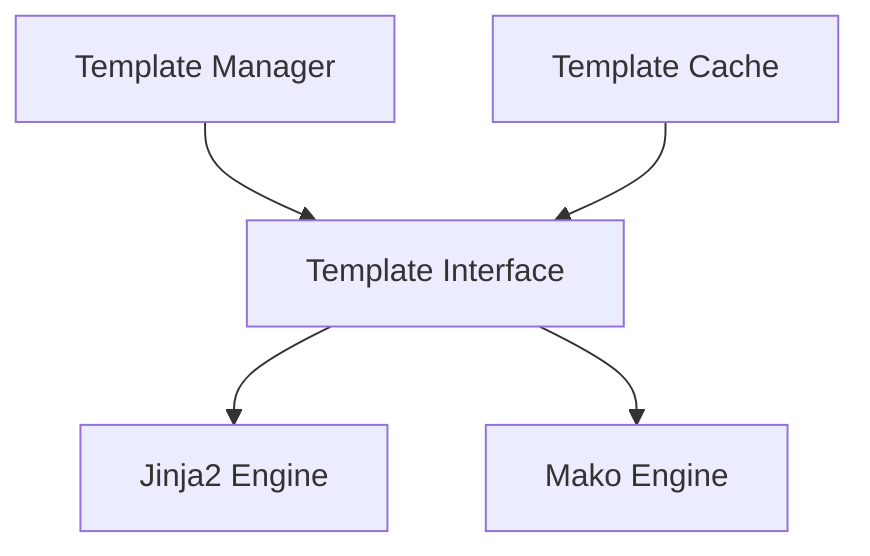

# templating - Functional Specification

**Version**: v0.1.7 | **Status**: Proposed | **Last Updated**: February 2026

## Purpose

Templating module providing template engine support (Jinja2, Mako) for code generation, documentation templates, and dynamic content. Consolidates `template/` and `module_template/` functionality.

## Design Principles

### Modularity

- Engine-agnostic template interface
- Support for multiple template engines
- Pluggable template system

### Internal Coherence

- Unified template rendering
- Consistent template patterns
- Integration with code generation

### Parsimony

- Essential templating operations
- Minimal dependencies
- Focus on common engines

### Functionality

- Working implementations for common engines
- Support for template inheritance
- Template caching

### Testing

- Unit tests for all engines
- Integration tests with templates
- Template rendering tests

### Documentation

- Complete API specifications
- Usage examples for each engine
- Template syntax documentation

## Architecture



## Functional Requirements

### Core Operations

1. **Render**: Render templates with context
2. **Load**: Load templates from files or strings
3. **Cache**: Cache compiled templates
4. **Inheritance**: Support template inheritance
5. **Filters**: Custom template filters

### Integration Points

- `module_template/` - Module generation templates
- `documentation/` - Documentation templates
- `code/` - Code generation templates

## Quality Standards

### Code Quality

- Type hints for all functions
- PEP 8 compliance
- Comprehensive error handling

### Testing Standards

- ≥80% coverage
- Engine-specific tests
- Template rendering tests

### Documentation Standards

- README.md, AGENTS.md, SPEC.md
- API_SPECIFICATION.md
- USAGE_EXAMPLES.md

## Interface Contracts

### Template Interface

```python
class TemplateEngine:
    def render(template: str, context: dict) -> str
    def load_template(path: str) -> Template
    def register_filter(name: str, func: callable) -> None
```

## Implementation Guidelines

### Template Implementation

1. Implement Template interface for each engine
2. Handle template loading and rendering
3. Support template caching
4. Provide filter registration

### Integration

1. Integrate with module_template
2. Add templating to documentation
3. Support code generation

## Navigation

- **Parent**: [codomyrmex](../AGENTS.md)
- **Related**: [module_template](../module_template/AGENTS.md), [documentation](../documentation/AGENTS.md)

<!-- Navigation Links keyword for score -->

