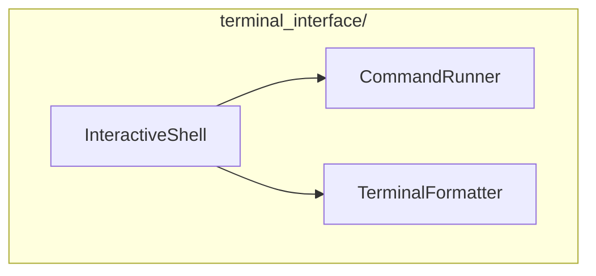

# Terminal Interface Module

**Version**: v0.1.0 | **Status**: Active | **Last Updated**: January 2026

## Overview

The Terminal Interface module provides interactive terminal interfaces and utilities for exploring and interacting with the Codomyrmex ecosystem. It includes an interactive shell, command runner, and terminal formatting utilities.

## Architecture



## Key Classes

| Class | Purpose |
|-------|---------|
| `InteractiveShell` | REPL-style interactive shell |
| `CommandRunner` | Execute and manage commands |
| `TerminalFormatter` | Rich text formatting for terminal |

## Quick Start

### Interactive Shell

```python
from codomyrmex.terminal_interface import InteractiveShell

# Create and run interactive shell
shell = InteractiveShell()
shell.run()

# Or with custom commands
shell = InteractiveShell()
shell.register_command("hello", lambda args: print("Hello, World!"))
shell.run()
```

### Command Runner

```python
from codomyrmex.terminal_interface import CommandRunner

runner = CommandRunner()

# Run a command
result = runner.run("ls -la")
print(result.stdout)

# Run with timeout
result = runner.run("long_process", timeout=30)
```

### Terminal Formatting

```python
from codomyrmex.terminal_interface import TerminalFormatter

fmt = TerminalFormatter()

# Colored output
print(fmt.success("Operation completed!"))
print(fmt.error("Something went wrong"))
print(fmt.warning("Be careful!"))
print(fmt.info("FYI: Here's some info"))

# Tables
data = [["Name", "Status"], ["Module A", "OK"], ["Module B", "Error"]]
print(fmt.table(data))

# Progress indicators
with fmt.spinner("Loading..."):
    do_work()
```

## Features

- **Interactive Shell**: REPL with command history and autocomplete
- **Rich Formatting**: Colors, tables, progress bars, spinners
- **Command Management**: Execute, timeout, and capture output
- **Cross-Platform**: Works on Windows, macOS, and Linux

## Integration Points

- **utils/ScriptBase**: CLI scripts use terminal formatting
- **logging_monitoring**: Terminal output for logs
- **orchestrator**: Progress display for workflows

## Navigation

- **Parent**: [../README.md](../README.md)
- **Siblings**: [cli](../cli/), [logging_monitoring](../logging_monitoring/)
- **Spec**: [SPEC.md](SPEC.md)
