# src/codomyrmex/terminal_interface

## Signposting
- **Parent**: [Parent](../README.md)
- **Children**:
    - None
- **Key Artifacts**:
    - [Agent Guide](AGENTS.md)
    - [Functional Spec](SPEC.md)

**Version**: v0.1.0 | **Status**: Active | **Last Updated**: December 2025

## Overview

Foundation module providing rich terminal interface capabilities for the Codomyrmex platform. This module enables consistent, interactive command-line experiences with colored output, progress indicators, and user-friendly interactions across all platform components.

The terminal_interface module serves as the user interaction foundation, ensuring consistent and accessible command-line experiences throughout the platform.

## Terminal Interface Flow

```mermaid
graph TD
    subgraph "User Input"
        Commands[⌨️ User Commands<br/>CLI Arguments]
        Interactive[💬 Interactive Input<br/>Prompts & Menus]
        Files[📄 File Input<br/>Configuration Files]
    end

    subgraph "Terminal Interface Layer"
        Parser[🔍 Input Parser<br/>Command Processing]
        Formatter[🎨 Terminal Formatter<br/>Color & Style]
        Validator[✅ Input Validator<br/>Type & Range Checks]
        Progress[📊 Progress Indicator<br/>Bars & Status]
    end

    subgraph "Output Rendering"
        Tables[📋 Table Formatter<br/>Structured Data]
        Messages[💬 Message Formatter<br/>Status & Errors]
        ProgressBars[📈 Progress Bars<br/>Operation Tracking]
        Boxes[📦 Box Renderer<br/>Content Framing]
    end

    subgraph "Terminal Display"
        Console[🖥️ Console Output<br/>Real-time Display]
        Logs[📝 Log Output<br/>Persistent Records]
        Reports[📄 Report Generation<br/>Formatted Results]
    end

    Commands --> Parser
    Interactive --> Parser
    Files --> Parser

    Parser --> Formatter
    Parser --> Validator

    Formatter --> Tables
    Formatter --> Messages
    Formatter --> ProgressBars
    Formatter --> Boxes

    Validator --> Parser

    Tables --> Console
    Messages --> Console
    ProgressBars --> Console
    Boxes --> Console

    Console --> Logs
    Console --> Reports

    Progress --> ProgressBars
```

### Interactive Shell Architecture

## Directory Contents
- `API_SPECIFICATION.md` – File
- `MCP_TOOL_SPECIFICATION.md` – File
- `SECURITY.md` – File
- `__init__.py` – File
- `interactive_shell.py` – File
- `terminal_utils.py` – File

## Navigation
- **Project Root**: [README](../../../README.md)
- **Parent Directory**: [codomyrmex](../README.md)
- **Src Hub**: [src](../../../src/README.md)