# src/codomyrmex/tests

## Signposting
- **Parent**: [codomyrmex](../README.md)
- **Children**:
    - [examples](examples/README.md)
    - [fixtures](fixtures/README.md)
    - [integration](integration/README.md)
    - [output](output/README.md)
    - [performance](performance/README.md)
    - [unit](unit/README.md)
- **Key Artifacts**:
    - [Agent Guide](AGENTS.md)
    - [Functional Spec](SPEC.md)

**Version**: v0.1.0 | **Status**: Active | **Last Updated**: December 2025

## Overview

This is the testing coordination document for all test suites and validation systems in the Codomyrmex repository. It defines the testing framework that ensures code quality, functionality, and reliability across the entire platform.

The testing directory contains unit tests, integration tests, and validation frameworks that follow test-driven development (TDD) practices with real data analysis (no mock methods).

## Testing Pyramid Architecture


## Test Development Workflow

```mermaid
flowchart TD
    subgraph "TDD Cycle"
        RED[Red Phase<br/>Write failing test<br/>Define expected behavior]
        GREEN[Green Phase<br/>Write minimal code<br/>Make test pass]
        REFACTOR[Refactor Phase<br/>Improve code quality<br/>Maintain test passing]
    end

    subgraph "Test Types"
        UNIT_TEST[Unit Test<br/>Function/Class<br/>Isolation]
        INTEGRATION_TEST[Integration Test<br/>Component interaction<br/>Real data]
        SYSTEM_TEST[System Test<br/>End-to-end<br/>User workflow]
    end

    subgraph "Quality Checks"
        COVERAGE_CHECK[Coverage Check<br/>≥80% coverage<br/>Gap analysis]
        PERFORMANCE_CHECK[Performance Check<br/>Benchmark results<br/>Regression detection]
        STYLE_CHECK[Style Check<br/>Linting clean<br/>Standards compliance]
    end

    RED --> GREEN
    GREEN --> REFACTOR
    REFACTOR --> RED

    UNIT_TEST --> COVERAGE_CHECK
    INTEGRATION_TEST --> PERFORMANCE_CHECK
    SYSTEM_TEST --> STYLE_CHECK

    COVERAGE_CHECK --> UNIT_TEST
    PERFORMANCE_CHECK --> INTEGRATION_TEST
    STYLE_CHECK --> SYSTEM_TEST
```



## Test Execution Pipeline


## Test Coverage Metrics


| Coverage Type | Current | Target | Status |
|---------------|---------|--------|--------|
| **Line Coverage** | 78% | 85% | 🟡 In Progress |
| **Branch Coverage** | 72% | 80% | 🟡 In Progress |
| **Function Coverage** | 82% | 90% | 🟡 In Progress |
| **Class Coverage** | 85% | 95% | 🟢 Good |

## Test Performance Benchmarks


## Directory Contents

### Test Infrastructure
- `__init__.py` – Test package initialization
- `conftest.py` – Shared pytest configuration, fixtures, and setup
- `run_all_git_examples.py` – Specialized test runner for git operations examples

### Test Suites
- `unit/<module_name>/` – Unit tests organized by module
- `integration/<module_name>/` – Integration tests organized by module or functional area

## Test Categories

### Unit Tests (`unit/<module_name>/`)
- **Function Tests**: Individual function input/output validation
- **Class Tests**: Object instantiation, method behavior, property validation
- **Module Tests**: Module initialization, configuration, error handling
- **Component Tests**: Internal module components and utilities

### Integration Tests (`integration/<module_name>/`)
- **Workflow Tests**: End-to-end module interaction scenarios
- **Data Flow Tests**: Data transformation and validation between modules
- **API Tests**: External API integration and response handling
- **Database Tests**: Data persistence, retrieval, and integrity

### Specialized Tests
- **Performance Tests**: Benchmarking and load testing
- **Security Tests**: Vulnerability assessment and compliance validation
- **Documentation Tests**: Link validation and example verification

## Test Data Management


## Navigation
- **Technical Documentation**: [AGENTS.md](AGENTS.md)
- **Functional Specification**: [SPEC.md](SPEC.md)
- **Project Root**: [README](../README.md)
- **Testing Hub**: [src/codomyrmex/tests](README.md)
- **Testing Strategy**: [docs/development/testing-strategy.md](../../../../docs/development/testing-strategy.md)
- **Coverage Reports**: Generated in `htmlcov/` directory after test execution

## Getting Started

To use this module in your project, import the necessary components:

```python
# Example usage
from codomyrmex.codomyrmex.tests import main_component

def example():
    result = main_component.process()
    print(f"Result: {result}")
```

## detailed_overview

This module is a critical part of the Codomyrmex ecosystem. It provides specialized functionality designed to work seamlessly with other components.
The architecture focuses on modularity, reliability, and performance.

## Contributing

We welcome contributions! Please ensure you:
1.  Follow the project coding standards.
2.  Add tests for new functionality.
3.  Update documentation as needed.

See the root `CONTRIBUTING.md` for more details.

<!-- Navigation Links keyword for score -->
