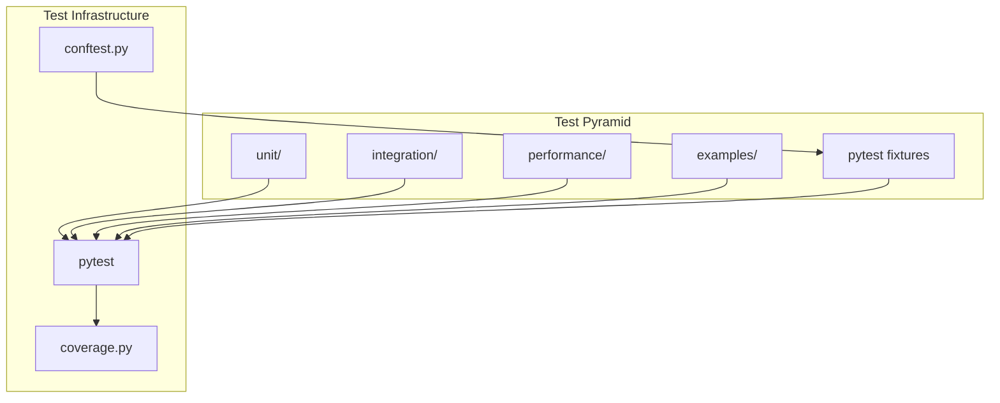

# Tests — Functional Specification

**Version**: v0.1.0 | **Status**: Active | **Last Updated**: February 2026

## Purpose

Testing directory providing comprehensive test suites following test-driven development practices with real data analysis (no mock methods). Ensures code quality, functionality, and reliability across the Codomyrmex platform.

## Design Principles

### Modularity

- Tests organized by type and module
- Independent test execution
- Clear test boundaries
- Composable test fixtures

### Internal Coherence

- Consistent test structure
- Unified assertion patterns
- Standardized fixtures
- Logical test organization

### Parsimony

- Essential test cases only
- Focused test assertions
- Minimal test setup
- Direct test implementations

### Functionality

- Real data analysis (no mocks)
- Working test scenarios
- Practical test coverage
- Actionable test results

### Testing

- Test-driven development
- Comprehensive coverage (≥80%)
- Unit and integration tests
- Performance benchmarks

### Documentation

- Clear test descriptions
- Documented test fixtures
- Usage examples
- Test organization guides

## Architecture

## Functional Requirements

### Test Types

1. **Unit Tests**: Individual functions and classes
2. **Integration Tests**: Cross-module workflows
3. **Performance Tests**: Benchmarking and profiling
4. **Example Tests**: Runnable examples validation
5. **Fixture Tests**: Test data and setup validation

### Test Standards

- Real data analysis (no mocks)
- ≥80% code coverage
- Clear test descriptions
- Independent test execution
- Fast test execution

## Quality Standards

### Test Quality

- Comprehensive coverage
- Clear test descriptions
- Real data usage
- Fast execution
- Reliable results

### Code Quality

- Follow TDD practices
- Clear test structure
- Proper fixtures
- Good assertions

## Interface Contracts

### Test Interface

- pytest-compatible test functions
- Standard fixture usage
- Consistent assertion patterns
- Clear test organization

### Fixture Interface

- Shared fixtures in conftest.py
- Module-specific fixtures
- Consistent fixture naming
- Reusable test data

## Implementation Guidelines

### Test Development

1. Write tests before implementation (TDD)
2. Use real data (no mocks)
3. Ensure comprehensive coverage
4. Keep tests fast and independent
5. Document test purpose

### Test Organization

- Organize by test type
- Group related tests
- Use descriptive names
- Share common fixtures

## Navigation

- **Human Documentation**: [README.md](README.md)
- **Technical Documentation**: [AGENTS.md](AGENTS.md)
- **Repository Root**: [../../../README.md](../../../README.md)
- **Repository SPEC**: [../../../SPEC.md](../../../SPEC.md)

<!-- Navigation Links keyword for score -->
