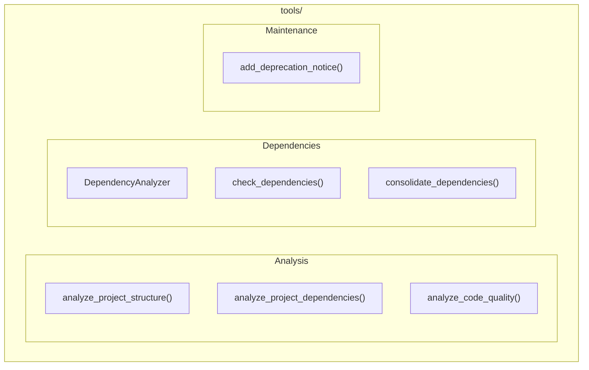

# Tools Module

**Version**: v0.1.0 | **Status**: Active | **Last Updated**: January 2026

## Overview

The Tools module provides development utilities and helper tools for project analysis, dependency management, and maintenance tasks for the Codomyrmex platform.

## Architecture



## Key Classes

| Class | Purpose |
|-------|---------|
| `DependencyAnalyzer` | Analyze module dependencies |

## Functions

| Function | Purpose |
|----------|---------|
| `analyze_project_structure()` | Analyze project structure |
| `analyze_project_dependencies()` | Analyze dependencies |
| `analyze_code_quality()` | Code quality metrics |
| `check_dependencies()` | Validate dependencies |
| `consolidate_dependencies()` | Find consolidation opportunities |
| `add_deprecation_notice()` | Add deprecation notices |

## Quick Start

### Project Analysis

```python
from codomyrmex.tools import (
    analyze_project_structure,
    analyze_code_quality
)

# Analyze structure
structure = analyze_project_structure("./src")
print(f"Files: {structure['total_files']}")
print(f"Modules: {structure['modules']}")

# Analyze quality
quality = analyze_code_quality("./src")
print(f"Complexity score: {quality['avg_complexity']}")
```

### Dependency Analysis

```python
from codomyrmex.tools import DependencyAnalyzer, check_dependencies

# Check for circular imports
analyzer = DependencyAnalyzer()
result = analyzer.analyze("./src/codomyrmex")

if result.circular_imports:
    print("Circular imports detected:")
    for cycle in result.circular_imports:
        print(f"  {' -> '.join(cycle)}")

# Validate dependencies
issues = check_dependencies("./requirements.txt")
```

### Dependency Consolidation

```python
from codomyrmex.tools import consolidate_dependencies

# Find consolidation opportunities
report = consolidate_dependencies("./")

for duplicate in report['duplicates']:
    print(f"Duplicate: {duplicate['package']}")
    print(f"  Found in: {duplicate['locations']}")
```

### CLI Usage

```bash
# Analyze project
python -m codomyrmex.tools.analyze_project ./src

# Check dependencies
python -m codomyrmex.tools.dependency_checker ./requirements.txt

# Analyze for circular imports
python -m codomyrmex.tools.dependency_analyzer ./src
```

## Integration Points

- **static_analysis**: Code quality analysis
- **system_discovery**: System introspection
- **logging_monitoring**: Tool logging

## Navigation

- **Parent**: [../README.md](../README.md)
- **Siblings**: [static_analysis](../static_analysis/), [system_discovery](../system_discovery/)
- **Spec**: [SPEC.md](SPEC.md)
