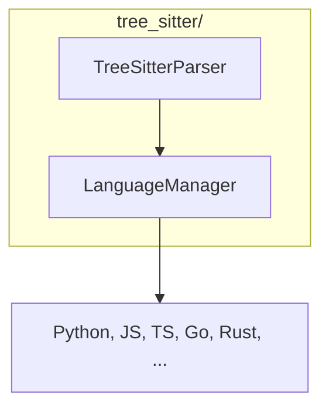

# Tree-Sitter Module

**Version**: v0.1.0 | **Status**: Active | **Last Updated**: January 2026

## Overview

The Tree-Sitter module provides AST (Abstract Syntax Tree) parsing capabilities for the Codomyrmex platform using the tree-sitter library. It enables language-agnostic code parsing and analysis.

## Architecture



## Key Classes

| Class | Purpose |
|-------|---------|
| `TreeSitterParser` | Parse source code into AST |
| `LanguageManager` | Manage language grammars |

## Quick Start

### Parse Code

```python
from codomyrmex.tree_sitter import TreeSitterParser

parser = TreeSitterParser()

# Parse Python code
tree = parser.parse("""
def hello(name):
    print(f"Hello, {name}!")
""", language="python")

# Traverse AST
for node in tree.root_node.children:
    print(f"{node.type}: {node.text}")
```

### Language Management

```python
from codomyrmex.tree_sitter import LanguageManager

lang_mgr = LanguageManager()

# Check available languages
print(lang_mgr.available_languages)

# Load specific language
lang_mgr.load("typescript")
```

### Query Nodes

```python
from codomyrmex.tree_sitter import TreeSitterParser

parser = TreeSitterParser()
tree = parser.parse(code, language="python")

# Find all function definitions
functions = parser.query(tree, "(function_definition) @func")
for func in functions:
    print(f"Function: {func['func'].text}")
```

## Supported Languages

Python, JavaScript, TypeScript, Go, Rust, C, C++, Java, Ruby, and more.

## Integration Points

- **pattern_matching**: Code pattern detection
- **static_analysis**: AST-based analysis
- **coding**: Code understanding

## Navigation

- **Parent**: [../README.md](../README.md)
- **Siblings**: [pattern_matching](../pattern_matching/), [static_analysis](../static_analysis/)
- **Spec**: [SPEC.md](SPEC.md)
