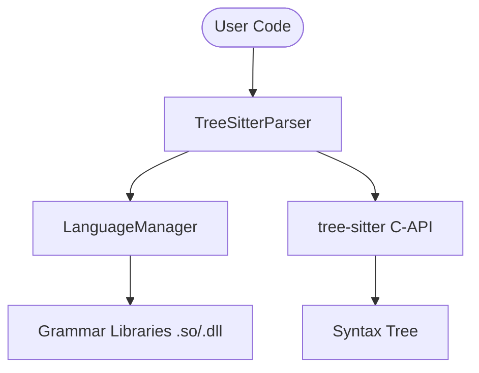

# tree_sitter - Functional Specification

## Purpose

To provide high-fidelity source code parsing across multiple programming languages, enabling advanced static analysis, code transformation, and intelligent auditing within the Codomyrmex ecosystem.

## Design Principles

- **Precision**: Utilize official Tree-sitter grammars for the highest accuracy.
- **Speed**: Leverage C-based parsing for high performance.
- **Extensibility**: Easily add support for new languages by bringing their grammars.
- **Simplicity**: Abstract the complexity of grammar compilation and C-API interactions.

## Architecture

## Functional Requirements

- Initialize parsers for supported languages (Python, JavaScript, TypeScript, Go, Rust, etc.).
- Update parsers when new code is received.
- Query ASTs using S-expression patterns.
- Retrieve source code snippets associated with specific nodes.
- Retrieve source code snippets associated with specific nodes.
- Handle multi-language files (e.g., HTML with CSS/JS).

## Interface Contracts

### `LanguageManager`

- `load_language(library_path: str, language_name: str) -> bool`
- `get_language(language_name: str) -> Optional[Language]`
- `discover_grammars(search_path: str) -> List[str]`

### `TreeSitterParser`

- `parse(source_code: Union[str, bytes]) -> Tree`
- `query(query_string: str, node: Node) -> List[Tuple[Node, str]]`

## Technical Constraints

- Requires `tree-sitter` Python bindings.
- Grammar compilation requires a C compiler and access to grammar source repositories.
- Compiled libraries are platform-specific.
