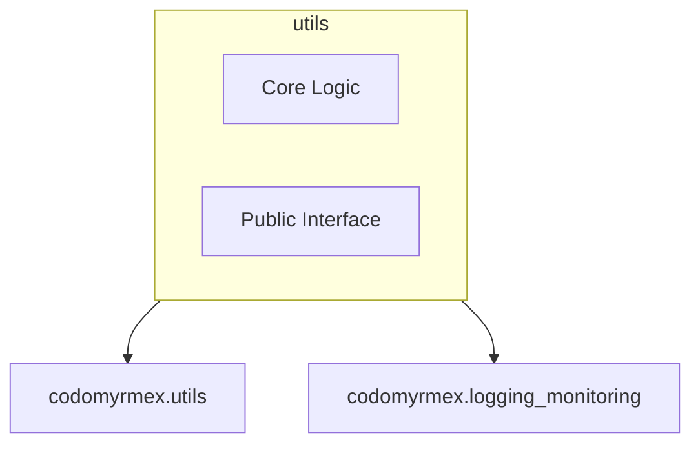

# Utils

**Version**: v0.1.0 | **Status**: Active

## Overview

Shared utility functions and helpers used across all Codomyrmex modules. Provides common operations for file handling, string manipulation, and data processing.

## Architecture



## Components

- **Core**: Implementation logic.
- **API**: Exposed functions and classes.

## Usage

```python
from codomyrmex.utils import ...

# Example usage
# result = process(...)
```

## Navigation

- **Full Documentation**: [docs/modules/utils/](../../../docs/modules/utils/)
- **Parent**: [codomyrmex](../README.md)
- **Spec**: [SPEC.md](SPEC.md)
- **Agents**: [AGENTS.md](AGENTS.md)
