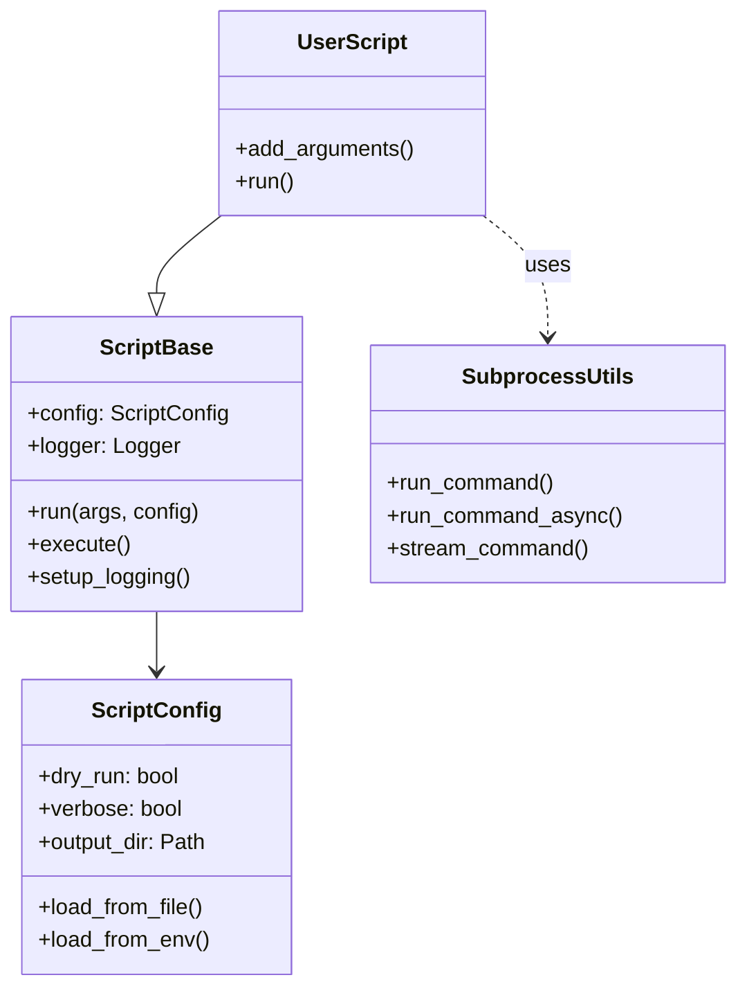

# utils

**Version**: v0.1.0 | **Status**: Active | **Last Updated**: January 2026

## Overview

The `utils` module provides the foundational building blocks for the Codomyrmex codebase. It exports standardized wrappers for system operations, file handling, and most importantly, the `ScriptBase` class which unifies all CLI tools and automation scripts.

## Architecture



## Core Components

### 1. ScriptBase (`script_base.py`)

A robust base class for creating CLI tools. It handles:

- **Argument Parsing**: Standardizes `--dry-run`, `--verbose`, `--config`.
- **Configuration**: Loads from CLI > Env Vars > Config File.
- **Logging**: Automatically sets up structured logging and file outputs.
- **Metrics**: Tracks execution time and success/failure states.
- **Output Management**: Creates timestamped output directories.

**Usage:**

```python
from codomyrmex.utils import ScriptBase

class MyTool(ScriptBase):
    def run(self, args, config):
        self.log_info(f"Processing {args.input}")
        return {"status": "success"}

if __name__ == "__main__":
    MyTool(name="my-tool", description="Demo").execute()
```

### 2. Subprocess Utilities (`subprocess.py`)

Safe wrappers around Python's `subprocess` module.

- `run_command`: Synchronous execution with timeout and retries.
- `run_command_async`: Async execution.
- `stream_command`: Yields output line-by-line for real-time monitoring.
- **Features**: Automatic quoting, shell injection protection, standardized error raising (`CommandError`).

### 3. General Utilities (`__init__.py`)

- `ensure_directory`: Idempotent directory creation.
- `safe_json_loads/dumps`: crash-proof JSON handling.
- `retry`: Decorator for exponential backoff.
- `timing_decorator`: Performance measurement.

## Navigation

- **Parent**: [codomyrmex](../README.md)
- **Source**: [script_base.py](script_base.py)
